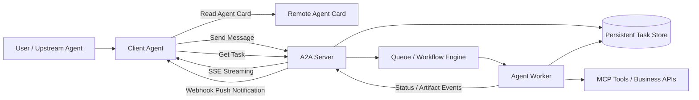

# A2A（Agent2Agent Protocol）完整资料整理：概念、能力、实现案例与异步分布式 Agent 任务分析

## 摘要

**A2A（Agent2Agent Protocol）** 是一个面向 AI Agent 之间互操作与协作的开放协议。它最初由 Google 在 2025 年提出，随后进入 Linux Foundation 的开放治理体系，目标是在不同厂商、不同框架、不同运行环境中的 Agent 之间建立标准化通信方式，使 Agent 能够发现彼此、声明能力、协商交互方式、创建和追踪长任务、交换中间状态与最终产物，并在不暴露内部推理、工具链或私有状态的前提下进行协作。

从工程角度看，A2A 并不是一个完整的分布式任务调度平台，也不是消息队列、工作流引擎或数据库的替代品。它更准确地说是**分布式 Agent 系统的应用层互操作协议**。它定义了 Agent 之间如何表达能力、如何发送消息、如何把一次工作表示为 Task、如何通过流式事件或推送通知表达异步进展，以及如何返回 Artifact。

对于“分布式 Agent 下的异步任务处理”这一问题，A2A 能解决**协议语义层**的问题，例如任务身份、状态机、回调通知、流式进度、长任务上下文和跨 Agent 交互；但生产级系统仍需要结合持久化 Task Store、消息队列、幂等控制、重试机制、权限系统、观测系统和编排/调度组件来完成完整闭环。

## 1. A2A 的定义与定位

A2A 的全称是 **Agent2Agent Protocol**。官方文档将其定位为一种让不同 Agent 能够彼此通信和协作的开放协议，重点解决 Agent-to-Agent 协作问题，而不是 Agent-to-Tool 的工具调用问题。[4] IBM Think 对 A2A 的解释也强调，它是面向多 Agent 系统的通信协议，用于支持来自不同提供商或不同 Agent 框架的 AI Agent 之间的互操作。[5]

> A2A focuses on enabling different agents to collaborate with one another to achieve a common goal.  
> —— A2A 官方文档《A2A and MCP》[4]

A2A 的核心思想可以概括为：一个 Agent 可以像访问一个标准服务一样访问另一个 Agent，但它访问的不是一个简单工具函数，而是一个具备自主性、状态、上下文、能力声明和多轮交互能力的远程 Agent。因此，A2A 更适合表达“委托一个复杂任务给另一个 Agent”这种场景，而不是“调用一个确定性函数”这种场景。

| 维度    | A2A 的定位                        | 说明                                                      |
| ----- | ------------------------------ | ------------------------------------------------------- |
| 交互对象  | Agent 与 Agent                  | Client Agent 将任务委托给 Remote Agent，Remote Agent 可独立推理和执行。 |
| 交互粒度  | 任务与对话                          | 不是简单 RPC 函数调用，而是围绕 Task、Message、Artifact 的持续协作。         |
| 执行透明度 | 不要求暴露内部实现                      | Remote Agent 可以保持 opaque，不暴露内部提示词、工具、记忆和执行计划。           |
| 传输基础  | HTTP(S)、JSON-RPC、SSE、Webhook 等 | A2A 建立在常见 Web 标准上，便于企业集成与网关治理。                          |
| 互补协议  | MCP                            | MCP 适合 Agent 调用工具和资源，A2A 适合 Agent 之间协作。                 |

A2A 的典型使用方式是，一个面向用户的主 Agent 作为 **A2A Client**，根据用户目标发现并调用若干远程专用 Agent，即 **A2A Server** 或 **Remote Agent**。例如，一个旅行规划 Agent 可以分别调用航班 Agent、酒店 Agent、汇率 Agent 和本地活动推荐 Agent；一个企业采购 Agent 可以调用供应商报价 Agent、合规审查 Agent 和库存查询 Agent；一个招聘 Agent 可以调用候选人搜索 Agent、面试安排 Agent 和背景调查 Agent。

## 2. A2A 与 MCP 的关系

理解 A2A 时最容易混淆的是 MCP。二者并非竞争关系，而是分工互补。**MCP（Model Context Protocol）** 关注模型或 Agent 如何安全、结构化地访问工具、API、数据库、文件系统等外部资源；**A2A** 关注多个自治 Agent 如何发现彼此、委托任务、共享任务上下文并持续协作。[4] [6]

| 对比项 | MCP | A2A |
|---|---|---|
| 核心问题 | Agent 如何使用工具和资源 | Agent 如何与其他 Agent 协作 |
| 交互对象 | 工具、API、数据库、文件、函数 | 具备自治能力和状态的远程 Agent |
| 典型语义 | 函数调用、资源读取、工具输出 | 任务委托、多轮对话、状态更新、Artifact 返回 |
| 状态特征 | 通常偏短事务或工具级状态 | 支持长任务、上下文、多轮交互和异步进展 |
| 工程组合 | Agent 内部用 MCP 调工具 | Agent 对外用 A2A 调其他 Agent |

在一个生产系统中，二者通常会同时存在。一个 Agent 对外暴露 A2A 接口，供其他 Agent 发现和委托任务；同时，它在内部使用 MCP 连接数据库、搜索服务、业务 API 或私有工具。官方文档也给出了类似汽车维修店的例子：维修经理 Agent 通过 A2A 与客户或零件供应商 Agent 交互，而维修技师 Agent 内部通过 MCP 调用诊断扫描仪、维修手册数据库等工具。[4]

## 3. A2A 的核心概念模型

A2A 的概念模型围绕 **Agent Card、Message、Task、Part、Artifact** 展开。它们共同构成了 Agent 发现、消息传递、任务管理和结果交付的基础数据结构。官方规范将 A2A 分成三层：Canonical Data Model、Abstract Operations 和 Protocol Bindings；这种分层保证了核心语义不依赖某一种具体传输绑定。[8]

| 概念 | 中文解释 | 在系统中的作用 |
|---|---|---|
| Agent Card | Agent 能力卡片 | 用于发现 Agent 的身份、服务地址、版本、能力、输入输出模式、技能与安全声明。 |
| Message | 消息 | 表示用户或 Agent 在某个上下文中的一次输入或响应，通常由若干 Part 组成。 |
| Part | 消息片段 | 表示消息中的具体内容，可以是文本、文件、URL 引用、结构化数据等。 |
| Task | 任务 | 表示远程 Agent 正在处理的有状态工作单元，包含 taskId、contextId、状态和历史。 |
| Artifact | 产物 | 表示任务生成的中间或最终交付物，例如文本答案、报告、图片、JSON 数据、文件引用。 |
| Capability | 能力声明 | 表示 Agent 是否支持 streaming、push notifications、扩展等协议能力。 |
| Skill | 技能声明 | 表示 Agent 可承接的业务能力，例如汇率换算、酒店搜索、代码审查等。 |

### 3.1 Agent Card：能力发现的入口

**Agent Card** 是 A2A 中最重要的发现机制。Remote Agent 通过 Agent Card 描述自己是谁、在哪里、能做什么、支持哪些输入输出模式、是否支持流式响应或推送通知，以及需要何种认证。官方文档说明，Agent Card 可以通过标准路径暴露，也可以通过企业注册中心或静态配置发现。[9]

下面是根据官方 Python 示例整理出的简化 Agent Card 创建代码。该示例来自 A2A samples 中的 `currencyagentdemo`，其中 Agent 声明自己支持 streaming，并暴露一个货币换算技能。[10]

```python
from a2a.types import AgentCapabilities, AgentCard, AgentSkill

capabilities = AgentCapabilities(streaming=True)

skill = AgentSkill(
    id="currency_exchange_agent",
    name="Currency Exchange Agent",
    description="Handles currency exchange queries and conversions.",
    tags=["currency", "exchange", "conversion", "travel", "finance"],
    examples=[
        "How much is 1 USD to EUR?",
        "Convert 100 GBP to USD",
    ],
)

agent_card = AgentCard(
    name="Currency Exchange Agent",
    description="A specialized currency exchange agent.",
    url="http://localhost:47128/",
    version="1.0.0",
    default_input_modes=["text"],
    default_output_modes=["text"],
    capabilities=capabilities,
    skills=[skill],
)
```

这个例子体现了 A2A 的一个关键工程原则：**调用方不需要知道远程 Agent 内部使用了什么模型、提示词、工具或框架，只需要读取 Agent Card 并根据其能力声明发起标准 A2A 请求。**

### 3.2 Task：长任务和异步处理的核心抽象

A2A 将一次远程工作抽象为 **Task**。Task 通常带有 `taskId` 和 `contextId`，前者用于唯一标识任务，后者用于把多轮消息归入同一个上下文。Task 的状态可以在执行过程中变化，例如 submitted、working、input_required、auth_required、completed、failed、canceled、rejected 等。官方规范也明确支持 Get Task、List Tasks、Cancel Task 等任务操作，并在 REST/JSON-RPC/gRPC 绑定中给出映射。[8]

| 状态类型 | 含义 | 工程用途 |
|---|---|---|
| submitted | 任务已提交 | 远程 Agent 已收到任务但可能尚未开始执行。 |
| working | 任务处理中 | 可用于前端展示进度，也可用于上游编排器判断任务仍在运行。 |
| input_required | 需要用户或上游 Agent 补充输入 | 支持 Human-in-the-loop 或多轮协商。 |
| auth_required | 需要授权 | 支持远程 Agent 把授权需求委托给调用方处理。[8] |
| completed | 已完成 | 可读取最终 Artifact。 |
| failed | 执行失败 | 需要错误处理、重试或降级。 |
| canceled | 已取消 | 支持上游主动终止任务。 |
| rejected | 被拒绝 | 远程 Agent 可基于能力、权限或策略拒绝请求。 |

Task 抽象对于分布式系统非常重要，因为它提供了跨网络边界追踪任务状态的标准语义。没有 Task 抽象时，Client Agent 很难区分“请求已收到但还没处理”“正在处理中”“需要用户补充信息”“已经完成但结果需要另取”“远程 Agent 拒绝执行”等状态。

### 3.3 Message、Part 与 Artifact：多模态交换

A2A 的 Message 通常包含多个 Part，Part 可以承载文本、文件、结构化数据或 URL 引用。Artifact 则表示远程 Agent 在任务执行过程中生成的结果。Artifact 可以是一次性最终结果，也可以通过流式方式分块产生。官方博客与规范都强调 A2A 具备**模态无关**特征，能够支持文本、文件、结构化 JSON、音视频引用乃至更复杂的 UI 组件引用。[1] [8]

在实际工程中，这意味着 A2A 不局限于聊天文本。一个图像处理 Agent 可以返回图片 URL；一个数据分析 Agent 可以返回 CSV、图表或 JSON；一个审批 Agent 可以返回结构化表单；一个代码 Agent 可以返回补丁文件和测试报告。

## 4. A2A 的相关能力与实现方式

A2A 的能力可以分为发现、调用、任务管理、流式响应、推送通知、多轮协商、安全治理和跨框架互操作几个层面。下表总结了这些能力与实现手段。

| 能力 | A2A 如何支持 | 典型实现方式 |
|---|---|---|
| Agent 发现 | Agent Card | `/.well-known/agent-card.json`、企业注册中心、静态配置。 |
| 能力声明 | Capabilities 与 Skills | 声明 streaming、push notifications、输入输出模式、技能描述和示例。 |
| 标准调用 | Send Message | Client Agent 使用标准请求向 Remote Agent 发送 Message。 |
| 长任务管理 | Task | 通过 taskId/contextId、状态机、Get/List/Cancel Task 追踪任务。 |
| 流式进度 | SSE Streaming | `message/stream` 或 SDK 的 streaming 调用返回事件流。 |
| 异步回调 | Push Notifications | Client 配置 webhook，Remote Agent 在任务状态变化时回调。 |
| 多轮交互 | input_required/auth_required | 远程 Agent 可请求补充输入或授权，而不是直接失败。 |
| 结果交付 | Artifact | 返回文本、文件、URL、结构化数据或分块结果。 |
| 企业安全 | HTTPS + 标准认证 | OAuth2/OIDC/API Key、网关、审计、最小权限、OpenTelemetry。 |
| 跨框架互操作 | 协议层统一 | LangGraph、CrewAI、ADK、Semantic Kernel 等可通过 A2A 暴露统一边界。 |

### 4.1 启动一个 A2A Server

官方 Python 示例中，A2A Server 通常由 `A2AStarletteApplication`、`DefaultRequestHandler`、`TaskStore`、`PushNotifier` 和用户自定义的 `AgentExecutor` 组成。下面是根据示例代码整理出的最小化服务端结构。[10]

```python
import httpx
import uvicorn

from a2a.server.apps import A2AStarletteApplication
from a2a.server.request_handlers import DefaultRequestHandler
from a2a.server.tasks import InMemoryPushNotifier, InMemoryTaskStore

# 自定义执行器，负责把 A2A Task 转换为具体 Agent 执行逻辑
executor = CurrencyAgentExecutor()

task_store = InMemoryTaskStore()
push_notifier = InMemoryPushNotifier(httpx.AsyncClient())

request_handler = DefaultRequestHandler(
    agent_executor=executor,
    task_store=task_store,
    push_notifier=push_notifier,
)

server = A2AStarletteApplication(
    agent_card=agent_card,
    http_handler=request_handler,
)

app = server.build()
uvicorn.run(app, host="localhost", port=47128)
```

这个结构清晰地把协议适配层与业务执行层分开：A2A Server 负责解析协议、管理任务和事件；`AgentExecutor` 负责实际调用模型、工具或业务系统。生产环境中，`InMemoryTaskStore` 应替换为数据库或分布式缓存，`InMemoryPushNotifier` 应替换为可重试、可审计、可签名的通知服务。

### 4.2 在 AgentExecutor 中发布任务状态与结果

A2A 的执行器通过事件队列向协议层发布任务状态和 Artifact。下面的代码片段根据官方 `CurrencyAgentExecutor` 示例整理而来，展示了如何在流式执行中发布 `working`、`input_required`、`completed` 状态，以及如何发送最终 Artifact。[10]

```python
from a2a.server.agent_execution import AgentExecutor, RequestContext
from a2a.server.events.event_queue import EventQueue
from a2a.types import TaskArtifactUpdateEvent, TaskState, TaskStatus, TaskStatusUpdateEvent
from a2a.utils import new_agent_text_message, new_task, new_text_artifact

class CurrencyAgentExecutor(AgentExecutor):
    def __init__(self):
        self.agent = CurrencyAgent()

    async def execute(self, context: RequestContext, event_queue: EventQueue) -> None:
        query = context.get_user_input()
        task = context.current_task

        if not task:
            task = new_task(context.message)
            event_queue.enqueue_event(task)

        async for partial in self.agent.stream(query, task.context_id):
            require_input = partial["require_user_input"]
            is_done = partial["is_task_complete"]
            text_content = partial["content"]

            if require_input:
                event_queue.enqueue_event(
                    TaskStatusUpdateEvent(
                        status=TaskStatus(
                            state=TaskState.input_required,
                            message=new_agent_text_message(text_content, task.context_id, task.id),
                        ),
                        final=True,
                        context_id=task.context_id,
                        task_id=task.id,
                    )
                )
            elif is_done:
                event_queue.enqueue_event(
                    TaskArtifactUpdateEvent(
                        append=False,
                        context_id=task.context_id,
                        task_id=task.id,
                        last_chunk=True,
                        artifact=new_text_artifact(
                            name="current_result",
                            description="Result of request to agent.",
                            text=text_content,
                        ),
                    )
                )
                event_queue.enqueue_event(
                    TaskStatusUpdateEvent(
                        status=TaskStatus(state=TaskState.completed),
                        final=True,
                        context_id=task.context_id,
                        task_id=task.id,
                    )
                )
            else:
                event_queue.enqueue_event(
                    TaskStatusUpdateEvent(
                        status=TaskStatus(
                            state=TaskState.working,
                            message=new_agent_text_message(text_content, task.context_id, task.id),
                        ),
                        final=False,
                        context_id=task.context_id,
                        task_id=task.id,
                    )
                )
```

这段代码展示了 A2A 对异步任务处理非常关键的一点：远程 Agent 不必等全部任务完成后才返回。它可以把“正在处理”“需要输入”“产出一部分结果”“任务完成”等变化作为标准事件发送给客户端。上游 Agent 或前端系统可以据此更新 UI、触发后续流程、请求用户输入或决定是否取消任务。

### 4.3 Client Agent 如何发现并调用远程 Agent

在多 Agent 示例中，Host Agent 使用 `A2ACardResolver` 读取远程 Agent Card，然后创建 `A2AClient` 与之通信。下面是根据示例整理的调用流程。[10]

```python
import httpx
import uuid

from a2a.client import A2AClient, A2ACardResolver
from a2a.types import MessageSendParams, SendMessageRequest

async def call_remote_agent(agent_base_url: str, task_text: str):
    async with httpx.AsyncClient(timeout=30) as http_client:
        resolver = A2ACardResolver(http_client, agent_base_url)
        agent_card = await resolver.get_agent_card()

        client = A2AClient(http_client, agent_card, url=agent_base_url)

        message_id = str(uuid.uuid4())
        payload = {
            "message": {
                "role": "user",
                "parts": [{"type": "text", "text": task_text}],
                "messageId": message_id,
                "contextId": str(uuid.uuid4()),
                "taskId": str(uuid.uuid4()),
            }
        }

        request = SendMessageRequest(
            id=message_id,
            params=MessageSendParams.model_validate(payload),
        )

        response = await client.send_message(message_request=request)
        return response
```

在更复杂的 Host Agent 中，远程 Agent 的 Agent Card 会被缓存到 `self.cards`，连接对象会被保存到 `self.remote_agent_connections`，主 Agent 根据用户意图、Agent 描述和当前上下文选择合适的远程 Agent，并把任务通过 `SendMessageRequest` 发送出去。[10]

### 4.4 Streaming：适合前台等待与实时进度

当 Remote Agent 支持 streaming 时，Agent Card 中会声明 `streaming=True`。客户端可以使用流式接口接收服务器通过 SSE 发出的事件。流式模式适合用户正在等待结果、需要实时进度反馈、或任务会逐步产生中间结果的场景。

流式的典型事件包括 Task 创建事件、`TaskStatusUpdateEvent`、`TaskArtifactUpdateEvent` 和最终完成事件。工程上，前端或上游 Agent 可以把这些事件映射为“任务已排队”“正在搜索”“正在调用外部系统”“已生成部分答案”“已完成”等用户可理解状态。

### 4.5 Push Notifications：适合后台长任务

对于可能持续数分钟、数小时甚至更长时间的任务，长时间维持 SSE 连接并不总是可靠或经济。A2A 因此支持 Push Notifications：Client Agent 在请求中提供回调 URL，Remote Agent 在任务状态发生关键变化时向该 URL 发送通知。官方资料将其作为异步场景的重要机制，并强调客户端收到通知后通常可以再调用 Get Task 获取完整任务状态和结果。[1] [8]

在生产系统中，Push Notification 应具备以下工程措施。

| 工程问题 | 建议做法 |
|---|---|
| 回调认证 | 使用 HTTPS、签名 Header、短期令牌、mTLS 或 OAuth2。 |
| 幂等处理 | 回调事件应携带 taskId、contextId、eventId 或版本号，接收端按事件唯一键去重。 |
| 重试策略 | 服务端推送失败后进入指数退避重试，并设置最大重试次数和死信队列。 |
| 完整性 | Webhook 只作为通知信号，客户端收到后调用 Get Task 拉取权威状态。 |
| 安全边界 | 不在回调中泄露敏感数据，Artifact 可用短期 URL 或受控存储访问。 |

## 5. 实际案例

### 5.1 采购礼宾 Agent 与远程商家 Agent

Google Codelab 提供了一个非常典型的 A2A 应用案例：用户只与一个 Purchasing Concierge Agent 交互，而该 Agent 作为 A2A Client/Host，去发现并调用部署在 Cloud Run 上的 Burger Agent 和 Pizza Agent。不同远程 Agent 可以由不同框架实现，例如 Burger Agent 使用 CrewAI，Pizza Agent 使用 LangGraph，Host Agent 则可以使用 Google ADK。[7]

该案例的价值在于展示了 A2A 的真实定位：它不是要求所有 Agent 迁移到同一框架，而是通过协议边界让不同框架、不同部署方式、不同能力边界的 Agent 能够协作。

| 角色 | 运行位置 | 技术/框架 | A2A 角色 | 职责 |
|---|---|---|---|---|
| Purchasing Concierge | Agent Engine 或本地入口 | ADK | A2A Client / Host | 接收用户需求，发现远程商家 Agent，组织对话并汇总结果。 |
| Burger Agent | Cloud Run | CrewAI | A2A Server | 处理汉堡菜单、下单、确认等任务。 |
| Pizza Agent | Cloud Run | LangGraph | A2A Server | 处理披萨菜单、下单、确认等任务。 |

典型流程是：Host Agent 读取远程商家 Agent 的 Agent Card；根据用户“我想订餐”的意图选择合适 Agent；发送 A2A Message；远程 Agent 创建 Task 并执行；执行过程中可以返回状态更新或请求用户补充信息；完成后返回订单 Artifact。这个过程与传统“工具调用”的差异在于，商家 Agent 不是一个简单函数，而是一个可多轮交互、可维护任务状态、可自主处理订单细节的远程 Agent。

### 5.2 汇率 Agent：流式任务与 Artifact 返回

官方 samples 中的 Currency Agent 展示了如何把一个业务 Agent 包装为 A2A Server。它的 Agent Card 声明技能为货币换算，支持文本输入和文本输出，并支持 streaming。执行器中，业务 Agent 的 `stream` 方法不断产生 partial 输出，A2A 层把这些 partial 映射为 Task 状态事件或 Artifact 事件。[10]

这个案例适合用于理解“如何把已有 Agent 变成 A2A Agent”。如果企业已有一个汇率查询、报销审批或数据分析 Agent，通常不需要重写核心逻辑，而是添加一层 A2A Adapter：Agent Card 描述能力，AgentExecutor 接收 Task，内部调用原有 Agent，然后通过 EventQueue 发布标准 A2A 事件。

### 5.3 多 Agent Host：路由与委托

A2A samples 的多 Agent 示例中，Host Agent 先读取多个远程 Agent 的 Agent Card，并把这些 Agent 的 name 和 description 拼接进路由 Agent 的系统指令。随后，当用户提出“查天气并安排住宿”之类目标时，Host Agent 通过函数工具 `send_message(agent_name, task)` 把子任务委托给合适远程 Agent。[10]

这种模式本质上是一个分布式 Agent 编排器。A2A 在其中承担标准通信边界：Host Agent 负责规划、拆分和选择；Remote Agent 负责执行自己的专长任务；Task 和 Message 负责维持跨 Agent 的上下文和状态。

## 6. A2A 是否可以解决分布式 Agent 下的异步任务处理？

结论是：**A2A 可以解决分布式 Agent 异步任务处理中的协议语义与互操作问题，但不能单独解决全部分布式系统工程问题。** 如果问题是“不同 Agent 如何标准化提交任务、追踪任务状态、接收异步进展、返回最终产物”，A2A 是高度相关且适用的；如果问题是“如何保证任务一定执行、如何跨机房调度、如何持久化状态、如何重试、如何做 exactly-once、如何限流、如何做资源调度”，A2A 需要与消息队列、数据库、工作流引擎和可观测系统组合使用。

### 6.1 A2A 可以直接覆盖的部分

A2A 对异步分布式 Agent 的主要贡献是提供标准化任务语义。Client Agent 不再只是发起一个 HTTP 请求并等待返回，而是可以获得一个 Task，并通过 streaming、polling 或 push notification 持续观察任务生命周期。这一点非常适合 Agent 任务，因为 Agent 任务往往耗时不确定、执行路径不确定、可能需要用户补充信息，也可能产生多个中间结果。

| 异步任务需求 | A2A 覆盖程度 | 原因 |
|---|---:|---|
| 提交远程任务 | 高 | Send Message 可创建或延续 Task。 |
| 标识任务与上下文 | 高 | taskId 和 contextId 支持任务追踪与多轮上下文。 |
| 查询任务状态 | 高 | Get Task / List Tasks 支持拉取当前状态。 |
| 实时进度 | 高 | Streaming 可发送状态事件与 Artifact 更新。 |
| 后台完成通知 | 高 | Push Notifications 支持 webhook 异步回调。 |
| 需要用户补充信息 | 高 | input_required 状态支持多轮协商。 |
| 需要授权 | 中高 | auth_required 状态支持授权请求上抛。 |
| 最终结果交付 | 高 | Artifact 支持文本、文件、结构化数据等结果。 |
| 跨框架协作 | 高 | 只要实现 A2A 边界，内部框架可不同。 |

因此，如果一个分布式 Agent 系统的核心诉求是“异构 Agent 如何以统一方式委托任务和回传结果”，A2A 是很合适的基础协议。

### 6.2 A2A 不能单独覆盖的部分

A2A 是协议，不是完整运行时。生产级异步任务系统需要处理网络分区、服务崩溃、重复请求、回调失败、任务超时、资源竞争、并发控制、消息积压、审计追踪和状态恢复等问题。这些问题通常超出 A2A 本身的范围。

| 工程问题 | A2A 是否单独解决 | 推荐补充组件 |
|---|---:|---|
| 任务持久化 | 否 | PostgreSQL、MySQL、Redis、DynamoDB、Cloud Spanner 等。 |
| 消息缓冲与削峰 | 否 | Kafka、RabbitMQ、NATS、SQS、Pub/Sub。 |
| 可靠重试与死信 | 否 | 队列重试、DLQ、工作流引擎。 |
| Exactly-once 语义 | 否 | 幂等键、事务外盒、去重表、状态机版本号。 |
| 分布式调度 | 否 | Temporal、Cadence、Argo Workflows、Airflow、Kubernetes Job。 |
| 任务超时与补偿 | 部分 | A2A 可表达 canceled/failed，但补偿逻辑需业务系统实现。 |
| 高可用任务恢复 | 否 | 持久 Task Store、Leader Election、幂等 Worker。 |
| 权限与租户隔离 | 部分 | A2A 声明认证方式，但授权策略与隔离需 IAM/网关实现。 |
| 可观测性 | 部分 | 需要 OpenTelemetry、日志、指标、Trace 关联。 |

这意味着，把 A2A 用于分布式异步 Agent 系统时，应避免把它误用为“任务队列”。它更像是跨 Agent 边界的**标准任务 API**，而不是底层调度系统。

### 6.3 推荐架构：A2A + 队列/工作流引擎 + 持久 Task Store

对于生产环境，可以采用如下架构：A2A Server 作为协议入口，收到 Message 后创建 Task 并写入持久 Task Store；随后把执行请求写入消息队列或工作流引擎；Worker 执行具体 Agent 逻辑；执行过程中不断更新 Task Store，并通过 A2A Streaming 或 Push Notification 通知 Client；Client 收到通知后调用 Get Task 获取权威状态和 Artifact。



在这种架构中，A2A 提供 Agent 间互操作语义；队列或工作流引擎提供可靠执行和调度；Task Store 提供状态恢复；观测系统提供跨服务追踪；IAM 和 API 网关提供身份认证、授权、限流和审计。

### 6.4 异步分布式 Agent 的设计建议

如果要用 A2A 构建分布式 Agent 异步任务系统，建议遵循以下原则。

| 设计原则 | 具体建议 |
|---|---|
| 明确协议层与执行层边界 | A2A Server 只做协议适配、任务登记、状态查询和通知；复杂执行交给 Worker 或工作流引擎。 |
| Task Store 必须持久化 | 不要在生产环境依赖 `InMemoryTaskStore`，否则服务重启会丢失任务状态。 |
| 所有外部请求必须幂等 | 使用 taskId、messageId、contextId 或业务幂等键防止重复提交和重复回调。 |
| Push Notification 只作为信号 | Webhook 收到通知后再调用 Get Task 拉取完整状态，避免回调丢失导致状态不一致。 |
| Streaming 与 Push 分场景使用 | 前台交互用 Streaming，后台长任务用 Push + Polling。 |
| Artifact 不直接塞入大对象 | 大文件应放对象存储，Artifact 中放 URL、哈希、MIME 类型和访问策略。 |
| 多 Agent 编排要有超时与补偿 | Host Agent 调用多个 Remote Agent 时应设置 deadline、fallback、cancel 和补偿策略。 |
| 认证与授权不能只靠 Agent Card | Agent Card 声明安全方案，实际访问仍应由 OAuth/OIDC/API Gateway/IAM 执行。 |
| 可观测性要贯穿 taskId/contextId | 日志、Trace、指标和审计事件都应携带 taskId、contextId 和 agent identity。 |

## 7. 与传统微服务、RPC 和工作流系统的区别

A2A 与微服务 RPC 很像，但它们的抽象层不同。RPC 通常表达“调用某个确定接口并返回结构化结果”；A2A 表达“把一个目标交给远程 Agent，让其围绕 Task 进行多轮、状态化、可能不确定路径的处理”。这也是为什么 A2A 特别强调 Task、Message、Artifact 和 input_required/auth_required 等状态。

| 系统类型 | 主要抽象 | 适合场景 | 与 A2A 的关系 |
|---|---|---|---|
| REST/RPC | 接口与请求响应 | 确定性业务 API | A2A 可运行在 HTTP/JSON-RPC 之上，但语义更偏 Agent Task。 |
| 消息队列 | 消息与消费者 | 削峰、异步、可靠投递 | A2A 可把任务交给队列执行，但不替代队列。 |
| 工作流引擎 | 状态机与步骤编排 | 长事务、补偿、重试 | A2A 可作为工作流中跨 Agent 调用的标准接口。 |
| MCP | 工具与资源 | Agent 调工具、查数据 | MCP 是 Agent 内部工具接入层，A2A 是 Agent 间协作层。 |
| A2A | Agent、Task、Message、Artifact | 异构 Agent 协作和长任务 | 提供分布式 Agent 的互操作协议语义。 |

## 8. 总结

A2A 是面向多 Agent 系统的重要协议，它通过 Agent Card、Task、Message、Artifact、Streaming 和 Push Notifications 等机制，为异构 Agent 的发现、委托、协作、状态追踪和结果交付提供了统一语言。它特别适合跨框架、跨组织、跨平台的 Agent 协作场景，例如采购、旅行规划、招聘、企业流程自动化、数据分析和客户服务。

对于“分布式 Agent 下的异步任务处理”，A2A 的价值非常明确：它能够标准化任务提交、任务状态、上下文关联、流式进展、异步回调和最终产物交付。但它不是完整的分布式执行平台。生产级系统应采用 **A2A + 持久 Task Store + 消息队列或工作流引擎 + IAM/API Gateway + OpenTelemetry** 的组合架构。这样既能获得 A2A 的跨 Agent 互操作优势，又能满足分布式系统对可靠性、可恢复性、可审计性和可扩展性的要求。

## References

[1]: https://developers.googleblog.com/en/a2a-a-new-era-of-agent-interoperability/ "Google Developers Blog: A2A - A new era of agent interoperability"  
[2]: https://github.com/a2aproject/A2A "GitHub: a2aproject/A2A"  
[3]: https://www.linuxfoundation.org/press/linux-foundation-launches-the-agent2agent-protocol-project-to-enable-secure-intelligent-communication-between-ai-agents "Linux Foundation launches the Agent2Agent Protocol project"  
[4]: https://a2a-protocol.org/latest/topics/a2a-and-mcp/ "A2A Protocol Documentation: A2A and MCP"  
[5]: https://www.ibm.com/think/topics/agent2agent-protocol "IBM Think: What is A2A protocol (Agent2Agent)?"  
[6]: https://auth0.com/blog/mcp-vs-a2a/ "Auth0 Blog: MCP vs A2A: A Guide to AI Agent Communication Protocols"  
[7]: https://codelabs.developers.google.com/intro-a2a-purchasing-concierge "Google Codelab: Getting Started with Agent2Agent Protocol"  
[8]: https://a2a-protocol.org/latest/specification/ "A2A Protocol Specification"  
[9]: https://a2a-protocol.org/latest/topics/agent-discovery/ "A2A Protocol Documentation: Agent Discovery"  
[10]: https://github.com/a2aproject/a2a-samples "GitHub: a2aproject/a2a-samples"  
