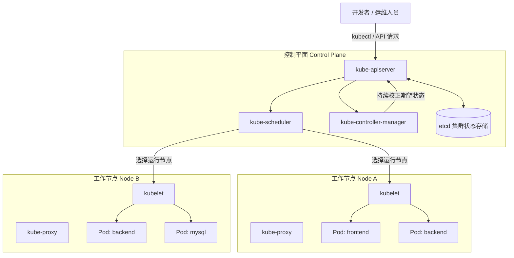
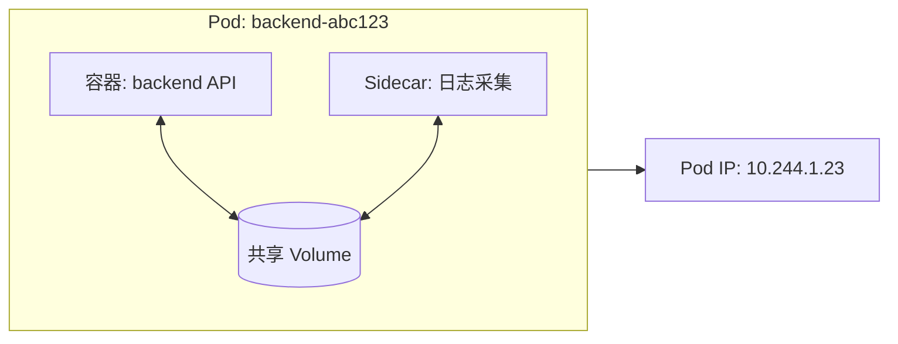
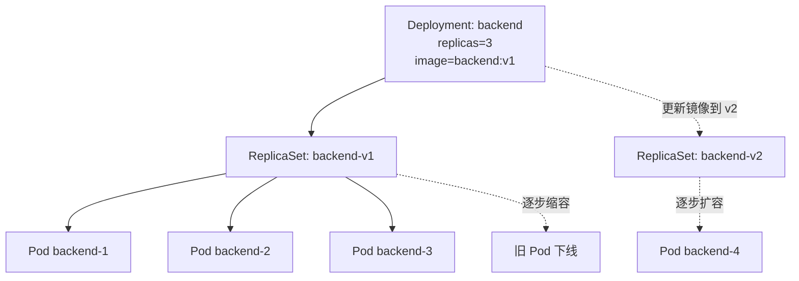
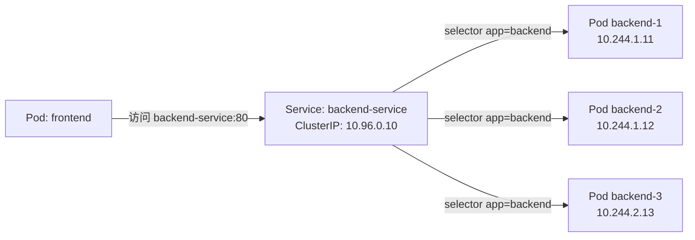
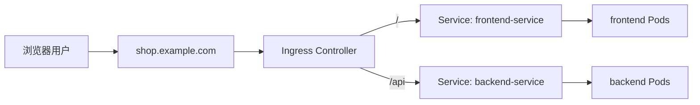
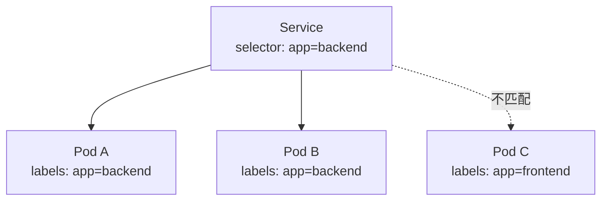
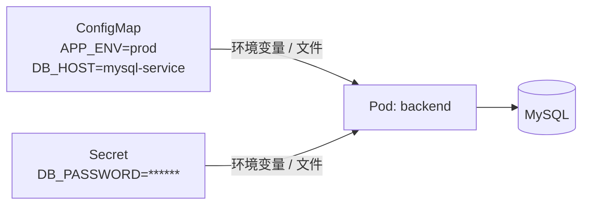
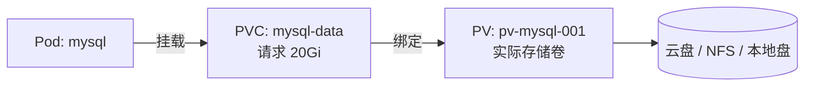
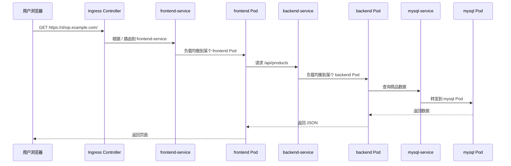

## 1. 为什么需要 Kubernetes

Kubernetes，通常简称 **K8s**，是一个用于自动化部署、扩缩容和管理容器化应用的开源系统。官方文档将其定位为“open source container orchestration engine”，也就是面向容器应用的编排引擎。[1] 如果把 Docker 或 containerd 理解为“把应用装进标准集装箱”的技术，那么 Kubernetes 更像是“自动化港口调度系统”：它决定容器运行在哪里、如何重启、如何扩容、如何暴露服务、如何滚动升级，以及如何在机器故障时让业务尽快恢复。

对于入门者来说，学习 Kubernetes 最重要的不是一开始记住所有 API，而是先建立一个清晰的心智模型：**Kubernetes 是一个声明式的集群管理系统，你告诉它期望状态，它通过控制器不断把实际状态调整到期望状态**。例如，你声明“我要运行 3 个 nginx 副本”，Kubernetes 就会持续检查集群中是否真的有 3 个可用 Pod；如果某个 Pod 崩溃，它会自动创建新的 Pod 来补足。

> Kubernetes 官方文档指出，Kubernetes 可用于自动化容器化应用的部署、扩缩容和管理。[1]

本文将以一个“电商网站”作为贯穿案例。这个系统包含前端 `frontend`、后端 API `backend`、数据库 `mysql`，并需要配置文件、密码、持久化存储和外部访问入口。通过这个案例，可以把 Kubernetes 的核心对象串起来理解。

| 传统部署视角        | Kubernetes 视角              | 核心收益      |
| ------------- | -------------------------- | --------- |
| 手动在服务器上启动进程   | 用 Pod 承载容器进程               | 标准化运行单元   |
| 手动维护进程数量      | 用 Deployment 声明副本数         | 自动修复与扩缩容  |
| 手动记录机器 IP 和端口 | 用 Service 提供稳定访问入口         | 服务发现与负载均衡 |
| Nginx 手写转发规则  | 用 Ingress 管理 HTTP/HTTPS 路由 | 统一入口治理    |
| 配置写死在镜像中      | 用 ConfigMap 和 Secret 外置配置  | 配置与镜像解耦   |
| 磁盘挂在某台机器上     | 用 PV/PVC 管理持久化存储           | 存储抽象与动态供给 |

## 2. Kubernetes 集群：控制平面与工作节点

一个 Kubernetes 集群通常由 **控制平面 Control Plane** 和多个 **工作节点 Worker Node** 组成。控制平面负责管理整个集群状态，包括接收 API 请求、调度 Pod、维护对象状态和保存集群数据；工作节点则是真正运行应用容器的地方。官方文档说明，Kubernetes 集群由控制平面和一个或多个工作节点组成，控制平面负责管理工作节点和集群中的 Pod。[2]



在这个架构中，`kube-apiserver` 是所有操作的入口，`etcd` 保存集群状态，`kube-scheduler` 负责为新 Pod 选择合适节点，`kube-controller-manager` 负责运行各种控制器，而每个节点上的 `kubelet` 负责根据控制平面的指令创建和管理 Pod。用户通常不会直接操作某台机器上的容器，而是通过 `kubectl apply -f xxx.yaml` 把声明式配置提交给 Kubernetes API。

| 组件                      | 所在位置 | 入门理解    | 典型作用                     |
| ----------------------- | ---- | ------- | ------------------------ |
| kube-apiserver          | 控制平面 | 集群的统一入口 | 接收 kubectl、控制器、调度器等请求    |
| etcd                    | 控制平面 | 集群数据库   | 保存对象、配置、状态等关键数据          |
| kube-scheduler          | 控制平面 | Pod 调度员 | 决定 Pod 放到哪个节点运行          |
| kube-controller-manager | 控制平面 | 状态纠偏器集合 | 持续把实际状态调整到期望状态           |
| kubelet                 | 工作节点 | 节点代理    | 在节点上创建、启动、监控 Pod         |
| kube-proxy              | 工作节点 | 服务网络代理  | 实现 Service 的网络转发规则       |
| Container Runtime       | 工作节点 | 容器运行时   | 运行容器，例如 containerd、CRI-O |

## 3. Kubernetes Object：一切都围绕对象声明

Kubernetes 中的大多数资源都以 **对象 Object** 的形式存在，例如 Pod、Deployment、Service、ConfigMap、Secret、Ingress、PersistentVolumeClaim 等。对象通常由 YAML 文件描述，提交给 API Server 后保存在集群状态中。Kubernetes 采用声明式 API 的核心含义是：用户主要描述“我想要什么”，而不是一步一步命令系统“如何做”。

一个典型对象 YAML 包含 `apiVersion`、`kind`、`metadata` 和 `spec`。其中，`kind` 表示对象类型，`metadata` 存放名称、标签等元数据，`spec` 描述期望状态。部分对象还会有 `status` 字段，表示 Kubernetes 观察到的实际状态，通常由系统自动更新。

```yaml
apiVersion: apps/v1
kind: Deployment
metadata:
  name: frontend
  labels:
    app: frontend
spec:
  replicas: 3
  selector:
    matchLabels:
      app: frontend
  template:
    metadata:
      labels:
        app: frontend
    spec:
      containers:
        - name: frontend
          image: nginx:1.25
          ports:
            - containerPort: 80
```

这个例子声明了一个名为 `frontend` 的 Deployment，希望运行 3 个带有 `app: frontend` 标签的 Pod。Kubernetes 接收该对象后，会让 Deployment 控制器创建 ReplicaSet，再由 ReplicaSet 创建并维持 3 个 Pod。

## 4. Pod：Kubernetes 最小部署单元

**Pod 是 Kubernetes 中最小的可部署计算单元**。一个 Pod 可以包含一个或多个容器，这些容器共享网络命名空间、存储卷以及生命周期。官方文档明确指出，Pod 是 Kubernetes 中可以创建和管理的最小可部署计算单元。[3]

在实际入门阶段，可以先把 Pod 理解为“容器外面的一层 K8s 包装”。例如，运行一个 nginx 容器时，Kubernetes 不会直接管理一个裸容器，而是创建一个 Pod，Pod 内部再运行 nginx 容器。每个 Pod 都会获得自己的 IP 地址，但 Pod 是临时性资源；如果节点宕机或 Pod 被重建，新 Pod 很可能拥有不同 IP，因此业务不应该直接依赖单个 Pod 的 IP。[4]



在电商案例中，`backend` Pod 可以运行后端 API 容器。如果需要把访问日志发送到日志系统，也可以在同一个 Pod 中加入 Sidecar 容器。两个容器因为在同一个 Pod 内，可以通过 `localhost` 通信，并共享挂载卷。

| Pod 特性   | 说明                            | 案例理解                          |
| -------- | ----------------------------- | ----------------------------- |
| 最小部署单元   | Kubernetes 调度和管理的是 Pod，而不是裸容器 | 后端 API 以 Pod 形式运行             |
| 共享网络     | 同一 Pod 内容器共享 IP 和端口空间         | 主容器与 Sidecar 可通过 localhost 通信 |
| 生命周期短暂   | Pod 可能被删除、重建、迁移               | 不应把 Pod IP 写死到配置中             |
| 通常由控制器创建 | 生产环境一般不用裸 Pod                 | 用 Deployment 管理无状态 Pod        |

## 5. Deployment、ReplicaSet 与滚动更新

**Deployment** 是最常用的工作负载对象之一，主要用于管理无状态应用。官方文档指出，Deployment 管理一组 Pod 来运行应用工作负载，通常用于不保存状态的应用，并且提供对 Pod 和 ReplicaSet 的声明式更新能力。[5]

Deployment 背后会创建 ReplicaSet，ReplicaSet 再维持指定数量的 Pod。入门时可以这样理解：Deployment 负责版本发布和回滚，ReplicaSet 负责副本数量，Pod 负责实际运行容器。用户通常直接操作 Deployment，而不是手动操作 ReplicaSet。



如果将 `backend` 镜像从 `backend:v1` 更新到 `backend:v2`，Deployment 会创建新的 ReplicaSet，并逐步增加新版本 Pod，同时逐步减少旧版本 Pod。这就是滚动更新。由于整个过程由控制器完成，服务可以在不中断或尽量少中断的情况下完成版本切换。

```yaml
apiVersion: apps/v1
kind: Deployment
metadata:
  name: backend
spec:
  replicas: 3
  selector:
    matchLabels:
      app: backend
  template:
    metadata:
      labels:
        app: backend
    spec:
      containers:
        - name: backend
          image: example/backend:v1
          ports:
            - containerPort: 8080
```

| 操作目标 | 推荐对象       | 示例命令                                                              | 结果                           |
| ---- | ---------- | ----------------------------------------------------------------- | ---------------------------- |
| 创建应用 | Deployment | `kubectl apply -f backend-deploy.yaml`                            | 创建 Deployment、ReplicaSet、Pod |
| 扩容应用 | Deployment | `kubectl scale deployment backend --replicas=5`                   | Pod 数量变为 5                   |
| 更新版本 | Deployment | `kubectl set image deployment/backend backend=example/backend:v2` | 触发滚动更新                       |
| 回滚版本 | Deployment | `kubectl rollout undo deployment/backend`                         | 回到上一个修订版本                    |

## 6. Service：给动态 Pod 提供稳定访问入口

由于 Pod 可能被频繁创建和销毁，Pod IP 并不适合作为稳定访问地址。**Service** 解决的正是这个问题。官方文档说明，Service 是一种将运行在一个或多个 Pod 中的网络应用暴露出来的方法，它为一组 Pod 提供稳定的网络抽象。[4]

在电商案例中，前端 `frontend` 不应该直接访问某个具体 `backend` Pod 的 IP，而应该访问 `backend-service`。Service 通过 Label Selector 找到所有 `app=backend` 的 Pod，并把请求负载均衡到这些 Pod 上。



```yaml
apiVersion: v1
kind: Service
metadata:
  name: backend-service
spec:
  selector:
    app: backend
  ports:
    - protocol: TCP
      port: 80
      targetPort: 8080
  type: ClusterIP
```

这里的 `port: 80` 表示 Service 对外提供的端口，`targetPort: 8080` 表示后端 Pod 内容器监听的端口。`selector: app: backend` 表示 Service 会选择所有带有该标签的 Pod 作为后端。

| Service 类型   | 访问范围            | 典型用途      | 入门理解          |
| ------------ | --------------- | --------- | ------------- |
| ClusterIP    | 集群内部            | 微服务之间访问   | 默认类型，内部稳定地址   |
| NodePort     | 集群外部可通过节点 IP 访问 | 测试或简单暴露服务 | 在每个节点打开固定端口   |
| LoadBalancer | 云厂商负载均衡器        | 生产外部访问    | 云环境常用方式       |
| ExternalName | DNS CNAME 映射    | 指向外部服务    | 把外部域名包装成集群服务名 |

## 7. Ingress：HTTP/HTTPS 的统一入口

Service 可以暴露网络服务，但如果一个集群中有很多 Web 应用，仅使用多个 LoadBalancer 往往成本高、管理复杂。**Ingress** 通常用于管理 HTTP/HTTPS 路由，把不同域名或路径转发到不同 Service。官方文档将 Ingress 描述为管理从集群外部到集群内部 Service 的 HTTP 和 HTTPS 路由的 API 对象。[6]

在电商案例中，可以让 `shop.example.com` 的 `/` 路径转发到 `frontend-service`，让 `/api` 路径转发到 `backend-service`。需要注意的是，Ingress 对象本身只是规则，真正执行转发的是 Ingress Controller，例如 NGINX Ingress Controller、Traefik 或云厂商提供的控制器。



```yaml
apiVersion: networking.k8s.io/v1
kind: Ingress
metadata:
  name: shop-ingress
spec:
  rules:
    - host: shop.example.com
      http:
        paths:
          - path: /
            pathType: Prefix
            backend:
              service:
                name: frontend-service
                port:
                  number: 80
          - path: /api
            pathType: Prefix
            backend:
              service:
                name: backend-service
                port:
                  number: 80
```

## 8. Label 与 Selector：Kubernetes 的资源关联机制

**Label** 是附加在对象上的键值对，**Selector** 用来根据标签选择对象。Kubernetes 中很多对象之间并不是通过硬编码名称直接绑定，而是通过标签选择器关联。例如，Deployment 的 `selector.matchLabels` 选择它要管理的 Pod；Service 的 `selector` 选择它要转发流量的 Pod。

在入门阶段，一定要特别重视标签设计。如果 Deployment 模板中的 Pod 标签是 `app: backend`，那么 Service 也必须用相同标签选择后端，否则 Service 找不到任何 Pod，请求就无法被转发。



| 对象            | 常见标签字段                      | Selector 作用              | 如果写错会怎样                |
| ------------- | --------------------------- | ------------------------ | ---------------------- |
| Pod           | `metadata.labels`           | 被 Deployment、Service 等选择 | 无法被控制器管理或服务发现          |
| Deployment    | `spec.selector.matchLabels` | 选择自己管理的 Pod              | 可能导致创建失败或管理混乱          |
| Service       | `spec.selector`             | 选择后端 Pod                 | Service 没有可用 Endpoints |
| NetworkPolicy | `podSelector`               | 选择被策略影响的 Pod             | 网络规则作用范围错误             |

## 9. Namespace：在一个集群中做逻辑隔离

**Namespace** 用于在同一个 Kubernetes 集群中划分多个逻辑空间。它并不是强隔离的虚拟集群，但非常适合按环境、团队或项目组织资源。例如，电商系统可以有 `dev`、`test` 和 `prod` 三个 Namespace，用于分别部署开发、测试和生产环境。

Namespace 的价值在于减少命名冲突、便于权限控制和资源配额管理。比如，`dev` Namespace 中可以有一个名为 `backend` 的 Deployment，`prod` Namespace 中也可以有一个同名 Deployment，它们彼此独立。

```bash
kubectl create namespace dev
kubectl create namespace prod
kubectl get pods -n prod
```

| 使用场景 | Namespace 设计 | 说明 |
|---|---|---|
| 多环境 | `dev`、`test`、`prod` | 最常见的入门实践 |
| 多团队 | `team-a`、`team-b` | 结合 RBAC 做权限控制 |
| 多项目 | `shop`、`payment`、`crm` | 按业务系统划分资源 |

## 10. ConfigMap 与 Secret：配置外置化

在容器化应用中，镜像应该尽量保持通用，不应把环境配置、数据库地址、密码直接写死在镜像里。Kubernetes 提供 **ConfigMap** 和 **Secret** 来完成配置外置化。ConfigMap 适合保存非敏感配置，例如应用模式、日志级别、后端地址；Secret 适合保存密码、令牌、证书等敏感信息。[7] [8]

在电商案例中，`backend` 需要读取数据库地址、用户名和密码。数据库地址可以放在 ConfigMap 中，数据库密码应放在 Secret 中。Pod 可以通过环境变量或挂载文件的方式读取这些配置。



```yaml
apiVersion: v1
kind: ConfigMap
metadata:
  name: backend-config
data:
  APP_ENV: "prod"
  DB_HOST: "mysql-service"
---
apiVersion: v1
kind: Secret
metadata:
  name: backend-secret
type: Opaque
stringData:
  DB_PASSWORD: "change-me"
---
apiVersion: apps/v1
kind: Deployment
metadata:
  name: backend
spec:
  replicas: 3
  selector:
    matchLabels:
      app: backend
  template:
    metadata:
      labels:
        app: backend
    spec:
      containers:
        - name: backend
          image: example/backend:v1
          env:
            - name: APP_ENV
              valueFrom:
                configMapKeyRef:
                  name: backend-config
                  key: APP_ENV
            - name: DB_HOST
              valueFrom:
                configMapKeyRef:
                  name: backend-config
                  key: DB_HOST
            - name: DB_PASSWORD
              valueFrom:
                secretKeyRef:
                  name: backend-secret
                  key: DB_PASSWORD
```

需要注意，Secret 并不等于天然绝对安全。它主要提供比 ConfigMap 更适合敏感数据的对象类型和访问方式，生产环境仍应结合 RBAC、加密静态数据、密钥轮换和外部密钥管理系统来使用。

## 11. Volume、PV 与 PVC：解决状态和持久化问题

Pod 本身是临时性的。如果数据库直接把数据写在容器文件系统里，一旦 Pod 被删除，数据就可能丢失。因此 Kubernetes 提供 Volume 体系来管理存储。入门时可以重点理解三个层次：**Volume 是 Pod 挂载的存储，PersistentVolume 是集群中的持久化存储资源，PersistentVolumeClaim 是应用对存储资源的申请**。[9]

在电商案例中，MySQL 需要持久化保存订单、用户等数据。可以为 MySQL 创建一个 PVC，让它申请 20Gi 存储，然后挂载到数据库容器的 `/var/lib/mysql` 目录。



```yaml
apiVersion: v1
kind: PersistentVolumeClaim
metadata:
  name: mysql-data
spec:
  accessModes:
    - ReadWriteOnce
  resources:
    requests:
      storage: 20Gi
```

| 概念                    | 入门理解       | 谁创建          | 典型用途            |
| --------------------- | ---------- | ------------ | --------------- |
| Volume                | Pod 可挂载的存储 | Pod spec 中声明 | 临时目录、配置文件、持久盘挂载 |
| PersistentVolume      | 集群级存储资源    | 管理员或动态供给器    | 表示一块可用持久化存储     |
| PersistentVolumeClaim | 应用对存储的申请   | 应用开发者或部署者    | 为数据库、消息队列申请磁盘   |
| StorageClass          | 动态供给规则     | 集群管理员        | 自动创建不同类型的存储卷    |

## 12. StatefulSet、DaemonSet、Job 与 CronJob

虽然 Deployment 是最常用的工作负载对象，但它并不能覆盖所有场景。Kubernetes 还提供多种控制器来管理不同类型的应用。入门时应先知道它们分别解决什么问题，而不必立即掌握所有细节。

| 工作负载对象      | 适合场景       | 特点           | 案例                    |
| ----------- | ---------- | ------------ | --------------------- |
| Deployment  | 无状态长期服务    | 支持副本、滚动更新、回滚 | frontend、backend      |
| StatefulSet | 有状态长期服务    | 稳定网络标识、稳定存储  | MySQL、Kafka、ZooKeeper |
| DaemonSet   | 每个节点运行一个副本 | 节点级代理或采集器    | 日志采集、监控 Agent         |
| Job         | 一次性任务      | 成功完成后退出      | 数据迁移、批处理              |
| CronJob     | 定时任务       | 按计划创建 Job    | 每晚备份、定时清理             |
|             |            |              |                       |

对于电商案例，前端和后端适合使用 Deployment；数据库如果部署在 K8s 中，更适合 StatefulSet；日志采集 Agent 适合 DaemonSet；每日凌晨订单统计可以用 CronJob。

## 13. 一次完整请求在 Kubernetes 中如何流转

把前面概念串起来，可以得到一次用户请求的完整路径。用户访问 `shop.example.com`，DNS 将域名解析到 Ingress Controller 的外部地址；Ingress 根据路径规则把请求转发到对应 Service；Service 再选择一个健康的 Pod；Pod 内的容器处理请求，必要时通过另一个 Service 访问数据库。



这个图展示了 Kubernetes 的核心抽象如何协作：Ingress 管外部 HTTP 入口，Service 管稳定服务发现和负载均衡，Deployment 管 Pod 副本和版本，ConfigMap/Secret 提供配置，PVC 为数据库提供持久化存储。

## 14. Kubernetes 入门命令心智模型

学习 Kubernetes 不能只看概念，还需要掌握最基本的观察和操作命令。建议把命令分为四类：创建资源、查看资源、排查问题、变更资源。这样可以形成较完整的日常操作闭环。

| 目标            | 命令                                          | 说明                  |
| ------------- | ------------------------------------------- | ------------------- |
| 应用 YAML       | `kubectl apply -f app.yaml`                 | 创建或更新声明式资源          |
| 查看 Pod        | `kubectl get pods -o wide`                  | 查看 Pod 状态、IP、所在节点   |
| 查看 Deployment | `kubectl get deploy`                        | 查看副本是否就绪            |
| 查看 Service    | `kubectl get svc`                           | 查看服务类型、ClusterIP、端口 |
| 查看详细信息        | `kubectl describe pod <pod-name>`           | 查看事件、调度、探针、挂载等信息    |
| 查看日志          | `kubectl logs <pod-name>`                   | 查看容器标准输出日志          |
| 进入容器          | `kubectl exec -it <pod-name> -- sh`         | 临时进入容器排查问题          |
| 扩容            | `kubectl scale deploy backend --replicas=5` | 修改期望副本数             |
| 查看发布状态        | `kubectl rollout status deploy/backend`     | 观察滚动更新是否完成          |
| 回滚            | `kubectl rollout undo deploy/backend`       | 回到上一版本              |

入门时建议形成一个固定排查顺序：先 `kubectl get` 看总体状态，再 `kubectl describe` 看事件和调度信息，再 `kubectl logs` 看应用日志，最后根据需要进入容器内部验证网络、配置或文件系统。

## 15. 常见入门误区

初学 Kubernetes 时，很多问题都来自对象之间关系没有理清。最常见的误区是把 Pod 当成长期稳定机器使用，直接记 Pod IP 或手动进入 Pod 修改文件。正确做法是把 Pod 当作随时可能重建的临时运行单元，把稳定访问交给 Service，把配置交给 ConfigMap/Secret，把持久化数据交给 PVC。

另一个常见误区是忽视 Label 和 Selector。Deployment、ReplicaSet、Service 之间的关联高度依赖标签，如果标签不一致，就可能出现 Deployment 创建了 Pod，但 Service 没有后端的情况。排查这类问题时，应该同时查看 Pod 标签、Service selector 和 EndpointSlice 或 Endpoints。

| 误区 | 后果 | 正确理解 |
|---|---|---|
| 直接访问 Pod IP | Pod 重建后 IP 变化导致访问失败 | 用 Service 提供稳定入口 |
| 在容器内手动改配置 | Pod 重建后修改丢失 | 用 ConfigMap/Secret 管理配置 |
| 只创建 Pod 不用 Deployment | Pod 崩溃后缺少高级发布能力 | 无状态服务优先用 Deployment |
| 数据写入容器本地文件系统 | Pod 删除后数据可能丢失 | 用 PVC 管理持久化数据 |
| 标签随意命名 | Service 或控制器匹配失败 | 设计清晰统一的 Label 体系 |

## 16. 推荐学习路径

建议 Kubernetes 入门按“先跑通、再理解、再治理”的顺序推进。第一阶段只需要掌握 Pod、Deployment、Service、Ingress、ConfigMap、Secret 和 PVC，能够部署一个简单 Web 应用。第二阶段再学习滚动更新、健康检查、资源限制、日志和监控。第三阶段再深入 RBAC、NetworkPolicy、Helm、Operator、多集群和 GitOps。

| 阶段 | 学习重点 | 可实践目标 |
|---|---|---|
| 第一阶段：基础运行 | Pod、Deployment、Service、Ingress | 在本地 minikube/kind 部署 Web 应用 |
| 第二阶段：稳定运行 | Probe、Resource、HPA、日志 | 应用可自愈、可扩容、可排查 |
| 第三阶段：生产治理 | RBAC、NetworkPolicy、Helm、GitOps | 面向团队和生产环境管理应用 |
| 第四阶段：平台化 | Operator、CRD、多集群 | 构建更高层的云原生平台能力 |

## 17. 一句话总结核心概念

Kubernetes 的核心可以浓缩为一句话：**用声明式对象描述应用期望状态，由控制平面持续协调节点、网络、存储和配置，使实际运行状态尽量符合期望状态**。其中，Pod 是运行单元，Deployment 是无状态应用控制器，Service 是稳定访问入口，Ingress 是 HTTP/HTTPS 流量入口，ConfigMap 和 Secret 是配置来源，PVC 是持久化存储申请，Namespace 是逻辑隔离边界，Label 和 Selector 则是把这些对象连接起来的胶水。

## References

[1]: https://kubernetes.io/docs/home/ "Kubernetes Documentation"
[2]: https://kubernetes.io/docs/concepts/overview/components/ "Kubernetes Components"
[3]: https://kubernetes.io/docs/concepts/workloads/pods/ "Pods"
[4]: https://kubernetes.io/docs/concepts/services-networking/service/ "Service"
[5]: https://kubernetes.io/docs/concepts/workloads/controllers/deployment/ "Deployments"
[6]: https://kubernetes.io/docs/concepts/services-networking/ingress/ "Ingress"
[7]: https://kubernetes.io/docs/concepts/configuration/configmap/ "ConfigMaps"
[8]: https://kubernetes.io/docs/concepts/configuration/secret/ "Secrets"
[9]: https://kubernetes.io/docs/concepts/storage/persistent-volumes/ "Persistent Volumes"
