# AI Manus Backend 架构文档
## 目录
- [1. 概述](#1-概述)
- [2. 整体架构](#2-整体架构)
- [3. 分层架构详解](#3-分层架构详解)
- [4. 核心业务流程](#4-核心业务流程)
- [5. 数据模型](#5-数据模型)
- [6. 外部集成](#6-外部集成)
- [7. 架构图](#7-架构图)
## 1. 概述
AI Manus Backend 是一个基于 FastAPI 的智能对话代理系统,采用领域驱动设计(DDD)架构模式。系统的核心功能是通过双Agent模式(Planner + Executor)实现智能任务规划和执行,支持Shell命令执行、浏览器自动化、文件操作、网络搜索等多种工具调用。
### 1.1 技术栈
- **Web框架**: FastAPI (异步)
- **数据库**: MongoDB (Beanie ODM)
- **缓存**: Redis (Streams, Cache)
- **LLM**: OpenAI API / 兼容的API (如DeepSeek)
- **容器化**: Docker (沙盒环境)
- **浏览器自动化**: Playwright
- **实时通信**: Server-Sent Events (SSE) + WebSocket
### 1.2 核心特性
- **领域驱动设计**: 清晰的分层架构,业务逻辑与技术实现分离
- **双Agent系统**: Planner Agent(规划) + Execution Agent(执行)
- **异步处理**: 全异步设计,高并发支持
- **实时流式响应**: SSE/WebSocket实现实时对话
- **沙盒隔离**: Docker容器提供安全的代码执行环境
- **可扩展工具系统**: 装饰器模式,易于添加新工具
- **事件溯源**: 完整的事件历史记录
## 2. 整体架构
### 2.1 架构图
整体架构图
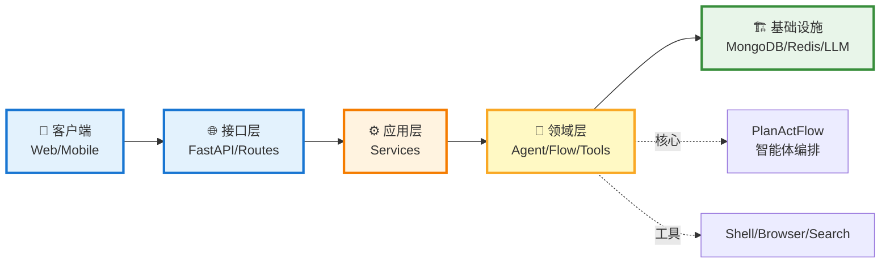
```mermaid
graph LR
    %% 样式
    classDef layer1 fill:#e3f2fd,stroke:#1976d2,stroke-width:3px
    classDef layer2 fill:#fff3e0,stroke:#f57c00,stroke-width:3px
    classDef layer3 fill:#fff9c4,stroke:#f9a825,stroke-width:3px
    classDef layer4 fill:#e8f5e9,stroke:#388e3c,stroke-width:3px

    Client[📱 客户端<br/>Web/Mobile]:::layer1
    Interface[🌐 接口层<br/>FastAPI/Routes]:::layer1
    Application[⚙️ 应用层<br/>Services]:::layer2
    Domain[🎯 领域层<br/>Agent/Flow/Tools]:::layer3
    Infrastructure[🏗️ 基础设施<br/>MongoDB/Redis/LLM]:::layer4

    Client --> Interface
    Interface --> Application
    Application --> Domain
    Domain --> Infrastructure

    %% 核心组件标注
    Domain -.-> |核心| PlanActFlow[PlanActFlow<br/>智能体编排]
    Domain -.-> |工具| Tools[Shell/Browser/Search]

```
详细流程架构图
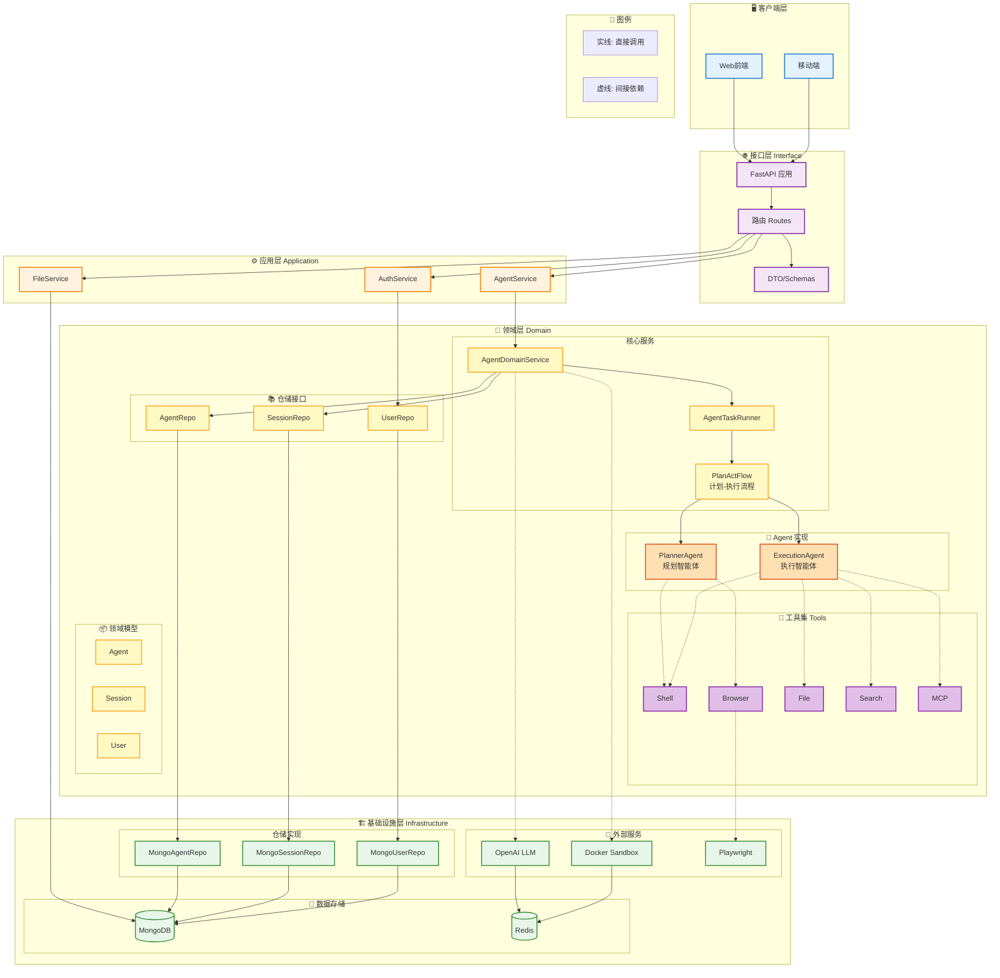
```mermaid
graph TB
    %% 样式定义
    classDef clientStyle fill:#e3f2fd,stroke:#1976d2,stroke-width:2px
    classDef interfaceStyle fill:#f3e5f5,stroke:#7b1fa2,stroke-width:2px
    classDef appStyle fill:#fff3e0,stroke:#f57c00,stroke-width:2px
    classDef domainStyle fill:#fff9c4,stroke:#f9a825,stroke-width:2px
    classDef infraStyle fill:#e8f5e9,stroke:#388e3c,stroke-width:2px
    classDef agentStyle fill:#ffe0b2,stroke:#e64a19,stroke-width:2px
    classDef toolStyle fill:#e1bee7,stroke:#8e24aa,stroke-width:2px
    
    %% 客户端层
    subgraph Client["🖥️ 客户端层"]
        Web[Web前端]:::clientStyle
        Mobile[移动端]:::clientStyle
    end

    %% 接口层
    subgraph Interface["🌐 接口层 Interface"]
        API[FastAPI 应用]:::interfaceStyle
        Routes[路由 Routes]:::interfaceStyle
        Schemas[DTO/Schemas]:::interfaceStyle
    end

    %% 应用层
    subgraph Application["⚙️ 应用层 Application"]
        AgentSvc[AgentService]:::appStyle
        AuthSvc[AuthService]:::appStyle
        FileSvc[FileService]:::appStyle
    end

    %% 领域层
    subgraph Domain["🎯 领域层 Domain"]
        
        subgraph DomainCore["核心服务"]
            AgentDS[AgentDomainService]:::domainStyle
            TaskRunner[AgentTaskRunner]:::domainStyle
            Flow[PlanActFlow<br/>计划-执行流程]:::domainStyle
        end
        
        subgraph Agents["🤖 Agent 实现"]
            Planner[PlannerAgent<br/>规划智能体]:::agentStyle
            Executor[ExecutionAgent<br/>执行智能体]:::agentStyle
        end
        
        subgraph Tools["🔧 工具集 Tools"]
            Shell[Shell]:::toolStyle
            Browser[Browser]:::toolStyle
            File[File]:::toolStyle
            Search[Search]:::toolStyle
            MCP[MCP]:::toolStyle
        end
        
        subgraph Models["📦 领域模型"]
            Agent[Agent]:::domainStyle
            Session[Session]:::domainStyle
            User[User]:::domainStyle
        end
        
        subgraph Repos["📚 仓储接口"]
            AgentRepo[AgentRepo]:::domainStyle
            SessionRepo[SessionRepo]:::domainStyle
            UserRepo[UserRepo]:::domainStyle
        end
    end

    %% 基础设施层
    subgraph Infrastructure["🏗️ 基础设施层 Infrastructure"]
        
        subgraph Storage["💾 数据存储"]
            MongoDB[(MongoDB)]:::infraStyle
            Redis[(Redis)]:::infraStyle
        end
        
        subgraph RepoImpl["仓储实现"]
            MongoAgentRepo[MongoAgentRepo]:::infraStyle
            MongoSessionRepo[MongoSessionRepo]:::infraStyle
            MongoUserRepo[MongoUserRepo]:::infraStyle
        end
        
        subgraph External["🔌 外部服务"]
            OpenAI[OpenAI LLM]:::infraStyle
            Docker[Docker Sandbox]:::infraStyle
            Playwright[Playwright]:::infraStyle
        end
    end

    %% 连接关系 - 垂直流向为主
    Web --> API
    Mobile --> API
    API --> Routes
    Routes --> Schemas
    
    Routes --> AgentSvc
    Routes --> AuthSvc
    Routes --> FileSvc
    
    AgentSvc --> AgentDS
    AuthSvc --> UserRepo
    FileSvc --> MongoDB
    
    AgentDS --> TaskRunner
    AgentDS --> AgentRepo
    AgentDS --> SessionRepo
    
    TaskRunner --> Flow
    Flow --> Planner
    Flow --> Executor
    
    Planner -.-> Shell
    Planner -.-> Browser
    Executor -.-> Shell
    Executor -.-> File
    Executor -.-> Search
    Executor -.-> MCP
    
    AgentRepo --> MongoAgentRepo
    SessionRepo --> MongoSessionRepo
    UserRepo --> MongoUserRepo
    
    MongoAgentRepo --> MongoDB
    MongoSessionRepo --> MongoDB
    MongoUserRepo --> MongoDB
    
    AgentDS -.-> OpenAI
    AgentDS -.-> Docker
    Browser -.-> Playwright
    
    OpenAI --> Redis
    Docker --> Redis

    %% 图例说明
    subgraph Legend["📖 图例"]
        L1[实线: 直接调用]
        L2[虚线: 间接依赖]
    end
```
### 2.2 分层职责
| 层级 | 职责 | 特点 |
|------|------|------|
| **接口层** | 对外暴露API,处理HTTP/WebSocket请求 | 依赖FastAPI,定义DTO,路由分发 |
| **应用层** | 编排业务流程,协调领域服务 | 无状态,事务边界 |
| **领域层** | 核心业务逻辑,领域模型 | 框架无关,纯业务逻辑 |
| **基础设施层** | 技术实现,外部服务集成 | 可替换的具体实现 |
## 3. 分层架构详解
### 3.1 领域层 (Domain Layer)
领域层是系统的核心,包含所有业务逻辑和领域模型,完全独立于框架和技术实现。
#### 3.1.1 领域模型 (Models)
**核心聚合根**:
```python
# Agent: 智能代理聚合根
class Agent:
	id: str # Agent唯一标识
	memories: Dict[str, Memory] # 对话记忆(按主题分类)
	model_name: str # 使用的LLM模型
	temperature: float # 生成温度参数
	max_tokens: int # 最大token数
	created_at: datetime
	updated_at: datetime

# Session: 会话聚合根
class Session:
	id: str # 会话ID
	user_id: str # 所属用户
	agent_id: str # 关联的Agent
	sandbox_id: Optional[str] # 沙盒环境ID
	task_id: Optional[str] # 运行中的任务ID
	title: Optional[str] # 会话标题
	status: SessionStatus # 状态: PENDING/RUNNING/WAITING/COMPLETED
	events: List[AgentEvent] # 事件历史
	files: List[FileInfo] # 附件列表
	is_shared: bool # 是否公开分享
	created_at: datetime
	updated_at: datetime
	latest_message: Optional[str] # 最新消息预览
	latest_message_at: Optional[datetime] # 最新消息时间
	unread_message_count: int # 未读消息数

# Plan: 执行计划
class Plan:
	title: str # 计划标题
	message: str # 计划说明
	steps: List[Step] # 步骤列表
	status: ExecutionStatus # 执行状态
	completed_steps: int # 已完成步骤数

# Step: 执行步骤
class Step:
	id: str # 步骤ID
	description: str # 步骤描述
	status: StepStatus # 状态: PENDING/RUNNING/COMPLETED/FAILED
	result: Optional[str] # 执行结果
```

**事件模型** (Event Sourcing):
```python
# 事件基类
class BaseEvent:
	id: Optional[str] # 事件ID
	timestamp: datetime # 时间戳

# 具体事件类型 (Union Type: AgentEvent)
- PlanEvent: 计划创建/更新/完成
- StepEvent: 步骤开始/完成/失败
- ToolEvent: 工具调用/结果返回
- MessageEvent: 消息生成
- TitleEvent: 标题生成
- ErrorEvent: 错误发生
- DoneEvent: 执行完成
- WaitEvent: 等待用户输入
```
#### 3.1.2 领域服务 (Services)
**AgentDomainService**: 领域服务协调器
```python
class AgentDomainService:
"""协调Planner和Executor的工作"""

	async def chat(session_id, user_id, message) -> AsyncGenerator[AgentEvent]:
	"""
	聊天主流程:
	1. 获取Session
	2. 获取或创建Task
	3. 将消息放入Task的输入流
	4. 从Task的输出流读取事件并yield
	"""

	async def _create_task(session: Session) -> Task:
	"""
	创建任务:
	1. 获取或创建Sandbox
	2. 获取Browser
	3. 创建AgentTaskRunner
	4. 创建Task并关联到Session
	"""

	async def stop_session(session_id):
	"""停止会话,取消关联的Task"""
```
**AgentTaskRunner**: 任务执行器
```python
class AgentTaskRunner(TaskRunner):
	"""实现TaskRunner接口,运行PlanActFlow"""

	async def run(task: Task):
	"""
	主循环:
	1. 从input_stream读取消息
	2. 运行PlanActFlow处理消息
	3. 将生成的事件写入output_stream
	4. 保存事件到Session
	"""
```
**PlanActFlow**: 计划-执行工作流
```python
class PlanActFlow(BaseFlow):
	"""
	双Agent协作流程:
	状态机: IDLE -> PLANNING -> EXECUTING -> UPDATING -> SUMMARIZING -> COMPLETED
	"""

	async def run(message: Message) -> AsyncGenerator[BaseEvent]:
	"""
	状态转换:
	1. PLANNING: PlannerAgent创建计划
	2. EXECUTING: ExecutionAgent执行步骤
	3. UPDATING: PlannerAgent更新计划
	4. SUMMARIZING: ExecutionAgent总结
	5. COMPLETED: 完成
	"""
```

#### 3.1.3 Agent实现
**PlannerAgent**: 规划Agent
- 职责: 创建执行计划、更新计划
- 输入: 用户消息、当前计划、已完成步骤
- 输出: PlanEvent (包含Plan对象)
- 特点: 使用结构化输出(JSON模式)

**ExecutionAgent**: 执行Agent
- 职责: 执行单个步骤、调用工具、总结结果
- 输入: 当前步骤、计划上下文
- 输出: StepEvent, ToolEvent, MessageEvent
- 特点: 支持工具调用(Function Calling)

#### 3.1.4 工具系统 (Tools)
工具使用装饰器模式注册:
```python
@tool(
	name="shell",
	description="Execute shell command",
	parameters={
		"command": {
		"type": "string",
		"description": "Shell command to execute"
		}
	}
)
async def shell_tool(command: str) -> ToolResult:
	# 执行逻辑
	pass
```
**可用工具**:
1. **ShellTool**: Shell命令执行
2. **BrowserTool**: 浏览器自动化(导航、点击、输入、截图等)
3. **FileTool**: 文件操作(读、写、列表、搜索、替换)
4. **SearchTool**: 网络搜索(Google/Bing/Baidu)
5. **MCPTool**: MCP协议集成
6. **MessageTool**: 发送消息给用户
7. **PlanTool**: 计划管理
#### 3.1.5 仓储接口 (Repository Interfaces)
```python
class AgentRepository(Protocol):
	async def save(agent: Agent) -> None
	async def find_by_id(agent_id: str) -> Optional[Agent]
	async def update(agent: Agent) -> None

class SessionRepository(Protocol):
	async def save(session: Session) -> None
	async def find_by_id(session_id: str) -> Optional[Session]
	async def find_by_user_id(user_id: str) -> List[Session]
	async def add_event(session_id: str, event: AgentEvent) -> None
	async def update_status(session_id: str, status: SessionStatus) -> None
```

#### 3.1.6 外部服务接口 (External Interfaces)
```python
class LLM(Protocol):
	"""大语言模型接口"""
	async def chat(messages, tools, response_format) -> Response

class Sandbox(Protocol):
	"""沙盒环境接口"""
	async def create() -> Sandbox
	async def get(sandbox_id: str) -> Optional[Sandbox]
	async def execute(command: str) -> Result
	async def file_read(path: str) -> Result
	async def get_browser() -> Browser

class Browser(Protocol):
	"""浏览器接口"""
	async def goto(url: str)
	async def click(selector: str)
	async def screenshot() -> bytes
```
### 3.2 应用层 (Application Layer)
应用层编排领域服务,处理应用级别的业务流程。
#### 3.2.1 应用服务
**AgentService**: Agent应用服务
```python
class AgentService:
	"""应用服务,提供高层业务接口"""

	async def create_session(user_id: str) -> Session:
	"""创建会话: 创建Agent -> 创建Session"""

	async def chat(session_id, user_id, message) -> AsyncGenerator[AgentEvent]:
	"""聊天: 委托给AgentDomainService"""

	async def get_session(session_id, user_id) -> Optional[Session]:
	"""获取会话(带权限验证)"""

	async def delete_session(session_id, user_id):
	"""删除会话(带权限验证)"""

	async def stop_session(session_id, user_id):
	"""停止会话(带权限验证)"""

	async def shell_view(session_id, shell_session_id, user_id) -> ShellViewResponse:
	"""查看Shell输出"""

	async def file_view(session_id, file_path, user_id) -> FileViewResponse:
	"""查看文件内容"""

	async def get_vnc_url(session_id) -> str:
	"""获取VNC连接URL"""
```

**AuthService**: 认证服务
```python
class AuthService:
	"""用户认证和授权"""

	async def register_user(email, password, fullname) -> User:
	"""用户注册: 验证 -> 哈希密码 -> 保存"""

	async def login_with_tokens(email, password) -> AuthToken:
	"""登录: 验证密码 -> 生成JWT token"""

	async def change_password(user_id, old_password, new_password):
	"""修改密码"""
```

**FileService**: 文件服务
```python
class FileService:
	"""文件管理"""

	async def upload_file(file_data, filename, user_id) -> FileInfo:
	"""上传文件到GridFS"""

	async def download_file(file_id, user_id) -> bytes:
	"""下载文件(带权限验证)"""

	async def delete_file(file_id, user_id):
	"""删除文件(带权限验证)"""
```

**TokenService**: Token服务
```python
class TokenService:
	"""JWT token管理"""

	def create_access_token(user: User) -> str:
	"""创建访问token (短期有效)"""

	def create_refresh_token(user: User) -> str:
	"""创建刷新token (长期有效)"""

	def verify_token(token: str) -> User:
	"""验证token并返回用户信息"""

	def create_signed_url(base_url: str, expire_minutes: int) -> str:
	"""创建签名URL (用于VNC等)"""
```

### 3.3 基础设施层 (Infrastructure Layer)
基础设施层提供领域层和应用层所需的技术实现。
#### 3.3.1 数据持久化
**MongoDB with Beanie ODM**:
```python
# 文档模型
class AgentDocument(Document):
	agent_id: str
	memories: Dict[str, dict]
	model_name: str
	temperature: float
	max_tokens: int
	created_at: datetime
	updated_at: datetime

class Settings:
	name = "agents"
	indexes = ["agent_id"]

class SessionDocument(Document):
	session_id: str
	user_id: str
	agent_id: str
	sandbox_id: Optional[str]
	task_id: Optional[str]
	title: Optional[str]
	status: str
	events: List[dict] # 存储为JSON
	files: List[dict]
	is_shared: bool
	created_at: datetime
	updated_at: datetime
	latest_message: Optional[str]
	latest_message_at: Optional[datetime]
	unread_message_count: int

class Settings:
	name = "sessions"
	indexes = ["session_id", "user_id"]
```

**Redis**:
- **Streams**: Task输入输出队列
- `task:input:{task_id}`: 任务输入流
- `task:output:{task_id}`: 任务输出流(事件流)
- **Cache**: 通用缓存
- **Task Registry**: 运行中的任务注册表

#### 3.3.2 外部服务实现
**OpenAILLM**: OpenAI API实现
```python
class OpenAILLM:
	"""
	OpenAI/兼容API的LLM实现
	- 支持自定义API Base (DeepSeek等)
	- 自动重试机制(指数退避)
	- 工具调用支持
	- JSON模式支持
	"""

	async def chat(
		messages: List[dict],
		tools: Optional[List[dict]] = None,
		response_format: Optional[dict] = None
	) -> Response:
	# 调用OpenAI API,3次重试,指数退避
	pass
```

**DockerSandbox**: Docker沙盒实现
```python
class DockerSandbox:
	"""
	Docker容器沙盒环境
	- 隔离的执行环境
	- TTL自动清理(默认30分钟)
	- 支持命令执行、文件操作
	- 内置浏览器(Chrome)
	- VNC访问支持
	"""

	@classmethod
	async def create() -> Sandbox:
	"""创建新容器"""

	async def execute(command: str, workdir: str) -> Result:
	"""执行命令"""

	async def file_read(path: str) -> Result:
	"""读取文件"""

	async def get_browser() -> Browser:
	"""获取浏览器实例(CDP连接)"""
```

**PlaywrightBrowser**: Playwright浏览器实现
```python
class PlaywrightBrowser:
	"""
	使用Playwright通过CDP连接到沙盒浏览器
	- 页面导航
	- 元素交互(点击、输入)
	- 截图
	- JavaScript执行
	- 控制台输出查看
	"""

	async def goto(url: str):
	"""导航到URL"""

	async def click(selector: str):
	"""点击元素"""

	async def screenshot() -> bytes:
	"""截图"""
```

**RedisTask**: Redis任务管理
```python
class RedisTask:
	"""
	基于Redis Streams的任务管理
	- 任务创建和执行
	- 输入输出流通信
	- 任务取消
	- 任务注册表
	"""

	@classmethod
	def create(task_runner: TaskRunner) -> Task:
	"""创建任务"""

	async def run():
	"""启动任务执行"""

	def cancel():
	"""取消任务"""
```

#### 3.3.3 仓储实现
**MongoAgentRepository**: MongoDB Agent仓储
```python
class MongoAgentRepository:
	"""Agent持久化到MongoDB"""

	async def save(agent: Agent):
	"""保存Agent (领域模型 -> 文档模型)"""

	async def find_by_id(agent_id: str) -> Optional[Agent]:
	"""查询Agent (文档模型 -> 领域模型)"""
```

**MongoSessionRepository**: MongoDB Session仓储
```python
class MongoSessionRepository:
	"""Session持久化到MongoDB"""

	async def save(session: Session):
	"""保存Session"""

	async def add_event(session_id: str, event: AgentEvent):
	"""添加事件到Session (追加到events数组)"""

	async def update_status(session_id: str, status: SessionStatus):
	"""更新Session状态"""

	async def find_by_user_id(user_id: str) -> List[Session]:
	"""查询用户的所有Session"""
```

### 3.4 接口层 (Interfaces Layer)
接口层负责对外暴露API,处理HTTP请求和响应。
#### 3.4.1 路由结构
```
/api/v1

├── /sessions # 会话管理
│ ├── PUT "" # 创建会话
│ ├── GET "" # 列出所有会话
│ ├── POST "" # SSE流式会话列表
│ ├── GET "/{id}" # 获取会话详情
│ ├── DELETE "/{id}" # 删除会话
│ ├── POST "/{id}/stop" # 停止会话
│ ├── POST "/{id}/chat" # 聊天 (SSE)
│ ├── WS "/{id}/chat" # 聊天 (WebSocket, 备选)
│ ├── POST "/{id}/shell" # 查看Shell输出
│ ├── POST "/{id}/file" # 查看文件内容
│ ├── WS "/{id}/vnc" # VNC连接
│ ├── POST "/{id}/vnc/signed-url" # 创建VNC签名URL
│ ├── POST "/{id}/share" # 分享会话
│ ├── DELETE "/{id}/share" # 取消分享
│ └── GET "/shared/{id}" # 获取共享会话
├── /files # 文件管理
│ ├── POST "" # 上传文件
│ ├── GET "/{id}" # 下载文件
│ ├── DELETE "/{id}" # 删除文件
│ └── GET "/{id}/info" # 获取文件信息
└── /auth # 认证
├── POST "/login" # 登录
├── POST "/register" # 注册
├── GET "/status" # 获取认证配置状态
├── POST "/change-password" # 修改密码
└── POST "/refresh-token" # 刷新token
```

#### 3.4.2 DTO Schemas
```python
# 请求Schema
class ChatRequest(BaseModel):
	message: str
	timestamp: Optional[int]
	event_id: Optional[str]
	attachments: Optional[List[dict]]

# 响应Schema
class GetSessionResponse(BaseModel):
	session_id: str
	title: Optional[str]
	status: SessionStatus
	events: List[SSEEvent]
	is_shared: bool

class ListSessionItem(BaseModel):
session_id: str
title: Optional[str]
status: SessionStatus
unread_message_count: int
latest_message: Optional[str]
latest_message_at: Optional[int]
is_shared: bool
```

#### 3.4.3 SSE事件映射
```python
class EventMapper:
	"""将领域事件映射为SSE事件"""

	@staticmethod
	async def event_to_sse_event(event: AgentEvent) -> Optional[SSEEvent]:
	"""
	映射规则:
	- PlanEvent -> "plan"
	- StepEvent -> "step"
	- ToolEvent -> "tool"
	- MessageEvent -> "message"
	- TitleEvent -> "title"
	- ErrorEvent -> "error"
	- DoneEvent -> "done"
	- WaitEvent -> "wait"
	"""
```

#### 3.4.4 依赖注入
```python
# 服务工厂 (单例)
@lru_cache()
def get_agent_service() -> AgentService:
	"""创建AgentService单例"""
	return AgentService(
		llm=get_llm(),
		agent_repository=get_agent_repository(),
		session_repository=get_session_repository(),
		sandbox_cls=DockerSandbox,
		task_cls=RedisTask,
		...
	)

# 认证依赖
async def get_current_user(
	token: str = Depends(oauth2_scheme)
) -> User:
	"""从JWT token获取当前用户"""
	return await get_token_service().verify_token(token)
```

## 4. 核心业务流程
### 4.1 创建会话流程

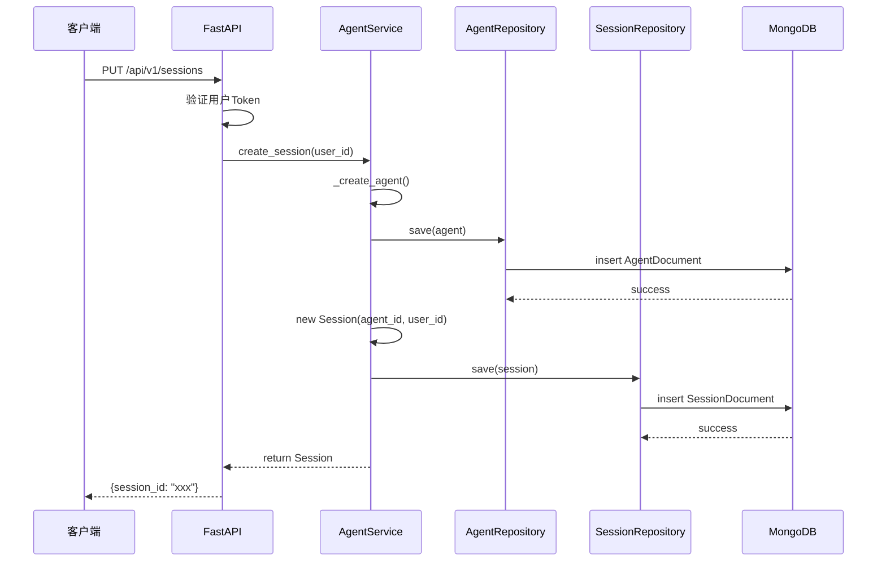
```mermaid

sequenceDiagram

participant Client as 客户端

participant API as FastAPI

participant AgentService as AgentService

participant AgentRepo as AgentRepository

participant SessionRepo as SessionRepository

participant MongoDB as MongoDB

  

Client->>API: PUT /api/v1/sessions

API->>API: 验证用户Token

API->>AgentService: create_session(user_id)

  

AgentService->>AgentService: _create_agent()

AgentService->>AgentRepo: save(agent)

AgentRepo->>MongoDB: insert AgentDocument

MongoDB-->>AgentRepo: success

  

AgentService->>AgentService: new Session(agent_id, user_id)

AgentService->>SessionRepo: save(session)

SessionRepo->>MongoDB: insert SessionDocument

MongoDB-->>SessionRepo: success

  

AgentService-->>API: return Session

API-->>Client: {session_id: "xxx"}

```

  

### 4.2 聊天流程 (核心流程)

  

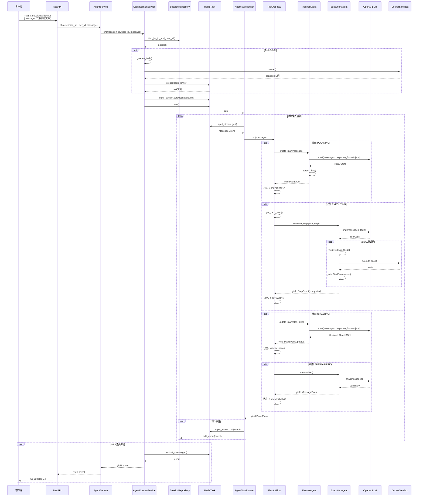
```mermaid

sequenceDiagram

participant Client as 客户端

participant API as FastAPI

participant AgentService as AgentService

participant AgentDomainService as AgentDomainService

participant SessionRepo as SessionRepository

participant Task as RedisTask

participant TaskRunner as AgentTaskRunner

participant PlanActFlow as PlanActFlow

participant Planner as PlannerAgent

participant Executor as ExecutionAgent

participant LLM as OpenAI LLM

participant Sandbox as DockerSandbox

  

Client->>API: POST /sessions/{id}/chat<br/>{message: "帮我创建文件"}

API->>AgentService: chat(session_id, user_id, message)

AgentService->>AgentDomainService: chat(session_id, user_id, message)

  

AgentDomainService->>SessionRepo: find_by_id_and_user_id()

SessionRepo-->>AgentDomainService: Session

  

alt Task不存在

AgentDomainService->>AgentDomainService: _create_task()

AgentDomainService->>Sandbox: create()

Sandbox-->>AgentDomainService: sandbox实例

AgentDomainService->>Task: create(TaskRunner)

Task-->>AgentDomainService: task实例

end

  

AgentDomainService->>Task: input_stream.put(MessageEvent)

AgentDomainService->>Task: run()

  

Task->>TaskRunner: run()

  

loop 读取输入消息

TaskRunner->>Task: input_stream.get()

Task-->>TaskRunner: MessageEvent

  

TaskRunner->>PlanActFlow: run(message)

  

alt 状态: PLANNING

PlanActFlow->>Planner: create_plan(message)

Planner->>LLM: chat(messages, response_format=json)

LLM-->>Planner: Plan JSON

Planner->>Planner: parse_plan()

Planner-->>PlanActFlow: yield PlanEvent

PlanActFlow->>PlanActFlow: 状态 -> EXECUTING

end

  

alt 状态: EXECUTING

PlanActFlow->>PlanActFlow: get_next_step()

PlanActFlow->>Executor: execute_step(plan, step)

Executor->>LLM: chat(messages, tools)

LLM-->>Executor: ToolCalls

  

loop 每个工具调用

Executor->>Executor: yield ToolEvent(call)

Executor->>Sandbox: execute_tool()

Sandbox-->>Executor: result

Executor->>Executor: yield ToolEvent(result)

end

  

Executor-->>PlanActFlow: yield StepEvent(completed)

PlanActFlow->>PlanActFlow: 状态 -> UPDATING

end

  

alt 状态: UPDATING

PlanActFlow->>Planner: update_plan(plan, step)

Planner->>LLM: chat(messages, response_format=json)

LLM-->>Planner: Updated Plan JSON

Planner-->>PlanActFlow: yield PlanEvent(updated)

PlanActFlow->>PlanActFlow: 状态 -> EXECUTING

end

  

alt 状态: SUMMARIZING

PlanActFlow->>Executor: summarize()

Executor->>LLM: chat(messages)

LLM-->>Executor: summary

Executor-->>PlanActFlow: yield MessageEvent

PlanActFlow->>PlanActFlow: 状态 -> COMPLETED

end

  

PlanActFlow-->>TaskRunner: yield DoneEvent

  

loop 每个事件

TaskRunner->>Task: output_stream.put(event)

TaskRunner->>SessionRepo: add_event(event)

end

end

  

loop SSE流式传输

AgentDomainService->>Task: output_stream.get()

Task-->>AgentDomainService: event

AgentDomainService-->>AgentService: yield event

AgentService-->>API: yield event

API-->>Client: SSE: data: {...}

end

```

  

### 4.3 PlanActFlow 状态机流程

  

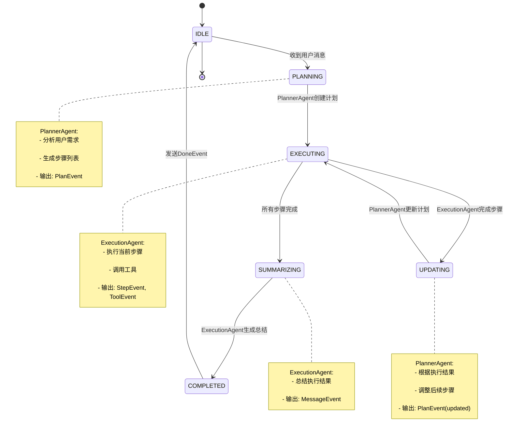
```mermaid

stateDiagram-v2

[*] --> IDLE

IDLE --> PLANNING: 收到用户消息

  

PLANNING --> EXECUTING: PlannerAgent创建计划

  

EXECUTING --> UPDATING: ExecutionAgent完成步骤

EXECUTING --> SUMMARIZING: 所有步骤完成

  

UPDATING --> EXECUTING: PlannerAgent更新计划

  

SUMMARIZING --> COMPLETED: ExecutionAgent生成总结

  

COMPLETED --> IDLE: 发送DoneEvent

IDLE --> [*]

  

note right of PLANNING

PlannerAgent:

- 分析用户需求

- 生成步骤列表

- 输出: PlanEvent

end note

  

note right of EXECUTING

ExecutionAgent:

- 执行当前步骤

- 调用工具

- 输出: StepEvent, ToolEvent

end note

  

note right of UPDATING

PlannerAgent:

- 根据执行结果

- 调整后续步骤

- 输出: PlanEvent(updated)

end note

  

note right of SUMMARIZING

ExecutionAgent:

- 总结执行结果

- 输出: MessageEvent

end note

```

  

### 4.4 工具调用流程

  

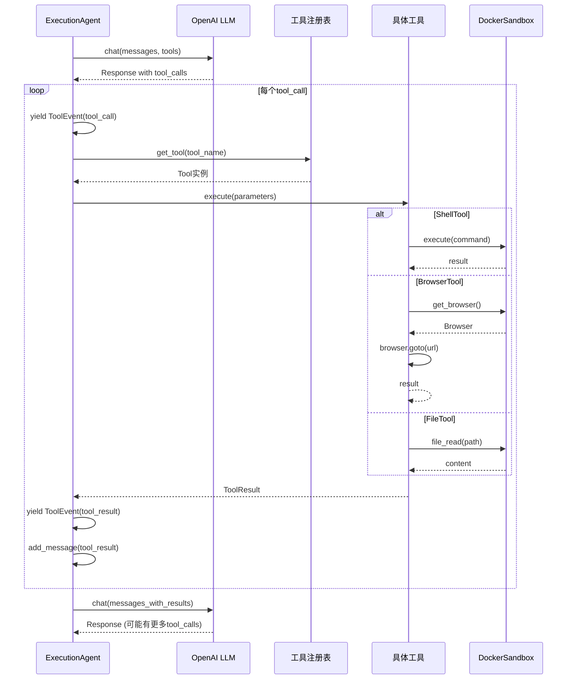
```mermaid

sequenceDiagram

participant ExecutionAgent

participant LLM as OpenAI LLM

participant ToolRegistry as 工具注册表

participant Tool as 具体工具

participant Sandbox as DockerSandbox

  

ExecutionAgent->>LLM: chat(messages, tools)

LLM-->>ExecutionAgent: Response with tool_calls

  

loop 每个tool_call

ExecutionAgent->>ExecutionAgent: yield ToolEvent(tool_call)

  

ExecutionAgent->>ToolRegistry: get_tool(tool_name)

ToolRegistry-->>ExecutionAgent: Tool实例

  

ExecutionAgent->>Tool: execute(parameters)

  

alt ShellTool

Tool->>Sandbox: execute(command)

Sandbox-->>Tool: result

else BrowserTool

Tool->>Sandbox: get_browser()

Sandbox-->>Tool: Browser

Tool->>Tool: browser.goto(url)

Tool-->>Tool: result

else FileTool

Tool->>Sandbox: file_read(path)

Sandbox-->>Tool: content

end

  

Tool-->>ExecutionAgent: ToolResult

  

ExecutionAgent->>ExecutionAgent: yield ToolEvent(tool_result)

ExecutionAgent->>ExecutionAgent: add_message(tool_result)

end

  

ExecutionAgent->>LLM: chat(messages_with_results)

LLM-->>ExecutionAgent: Response (可能有更多tool_calls)

```

  

### 4.5 事件流转流程

  

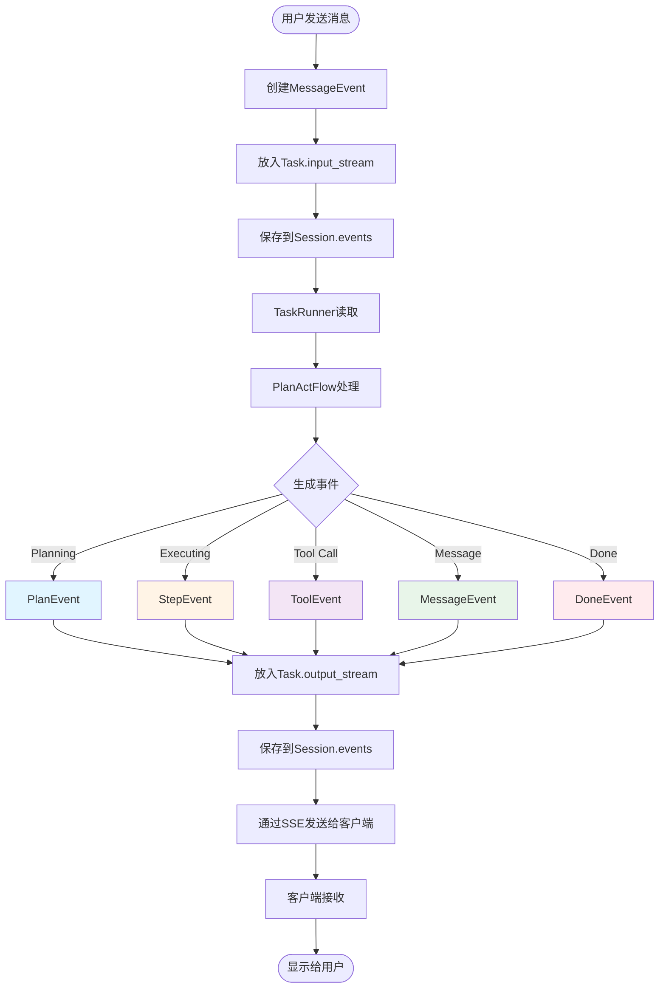
```mermaid

flowchart TD

Start([用户发送消息]) --> CreateEvent[创建MessageEvent]

CreateEvent --> PutInput[放入Task.input_stream]

PutInput --> SaveEvent1[保存到Session.events]

  

SaveEvent1 --> TaskRunner[TaskRunner读取]

TaskRunner --> PlanActFlow[PlanActFlow处理]

  

PlanActFlow --> GenerateEvents{生成事件}

  

GenerateEvents -->|Planning| PlanEvent[PlanEvent]

GenerateEvents -->|Executing| StepEvent[StepEvent]

GenerateEvents -->|Tool Call| ToolEvent[ToolEvent]

GenerateEvents -->|Message| MessageEvent2[MessageEvent]

GenerateEvents -->|Done| DoneEvent[DoneEvent]

  

PlanEvent --> PutOutput[放入Task.output_stream]

StepEvent --> PutOutput

ToolEvent --> PutOutput

MessageEvent2 --> PutOutput

DoneEvent --> PutOutput

  

PutOutput --> SaveEvent2[保存到Session.events]

SaveEvent2 --> SSE[通过SSE发送给客户端]

  

SSE --> Client[客户端接收]

Client --> End([显示给用户])

  

style PlanEvent fill:#e1f5ff

style StepEvent fill:#fff4e6

style ToolEvent fill:#f3e5f5

style MessageEvent2 fill:#e8f5e9

style DoneEvent fill:#ffebee

```
### 4.6 会话中断流程
当用户主动停止会话时,系统通过优雅的异步任务取消机制实现中断。
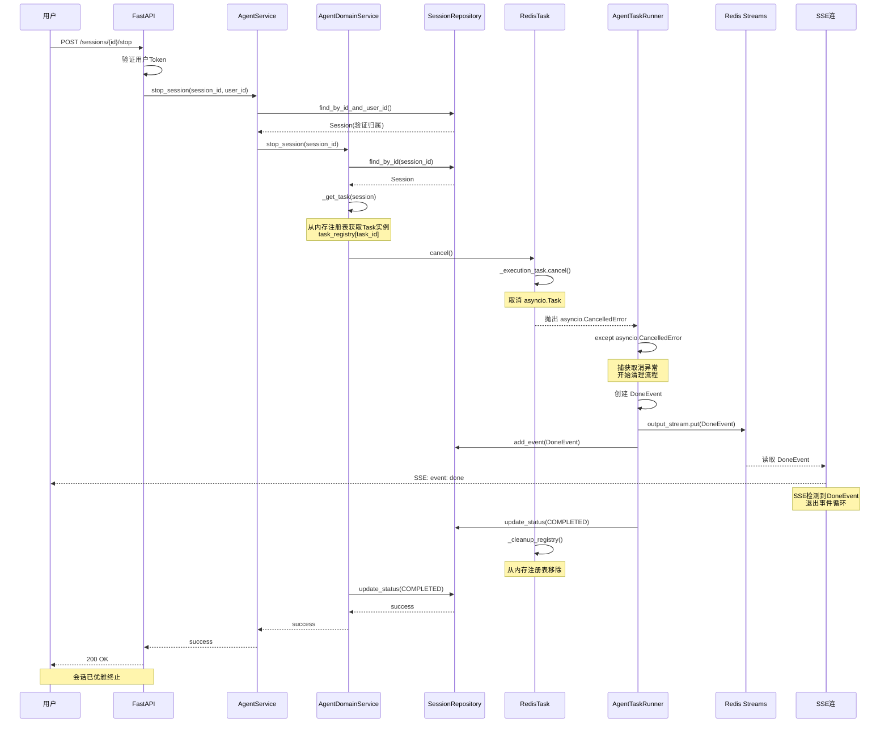
```mermaid
sequenceDiagram
participant User as 用户
participant API as FastAPI
participant AgentService as AgentService
participant AgentDomainService as AgentDomainService
participant SessionRepo as SessionRepository
participant Task as RedisTask
participant TaskRunner as AgentTaskRunner
participant Redis as Redis Streams
participant SSE as SSE连

User->>API: POST /sessions/{id}/stop
API->>API: 验证用户Token
API->>AgentService: stop_session(session_id, user_id)

AgentService->>SessionRepo: find_by_id_and_user_id()
SessionRepo-->>AgentService: Session(验证归属)

AgentService->>AgentDomainService: stop_session(session_id)

AgentDomainService->>SessionRepo: find_by_id(session_id)
SessionRepo-->>AgentDomainService: Session

AgentDomainService->>AgentDomainService: _get_task(session)
Note over AgentDomainService: 从内存注册表获取Task实例<br/>task_registry[task_id]

AgentDomainService->>Task: cancel()

Task->>Task: _execution_task.cancel()
Note over Task: 取消 asyncio.Task

Task-->>TaskRunner: 抛出 asyncio.CancelledError

TaskRunner->>TaskRunner: except asyncio.CancelledError
Note over TaskRunner: 捕获取消异常<br/>开始清理流程

TaskRunner->>TaskRunner: 创建 DoneEvent
TaskRunner->>Redis: output_stream.put(DoneEvent)
TaskRunner->>SessionRepo: add_event(DoneEvent)

Redis-->>SSE: 读取 DoneEvent
SSE-->>User: SSE: event: done

Note over SSE: SSE检测到DoneEvent<br/>退出事件循环

TaskRunner->>SessionRepo: update_status(COMPLETED)

Task->>Task: _cleanup_registry()
Note over Task: 从内存注册表移除

AgentDomainService->>SessionRepo: update_status(COMPLETED)

SessionRepo-->>AgentDomainService: success
AgentDomainService-->>AgentService: success
AgentService-->>API: success
API-->>User: 200 OK

Note over User,API: 会话已优雅终止
```
#### 4.6.1 中断机制详解
**三层取消机制**:
1. **API层取消**: 用户请求 `POST /sessions/{id}/stop`
2. **Task层取消**: 调用 `task.cancel()` 取消 asyncio.Task
3. **异常处理层**: 捕获 `asyncio.CancelledError` 并发送终止信号

**关键代码位置**:
- API入口: `backend/app/interfaces/api/session_routes.py:70-77`
- 应用层: `backend/app/application/services/agent_service.py:130-139`
- 领域层: `backend/app/domain/services/agent_domain_service.py:105-114`
- Task实现: `backend/app/infrastructure/external/task/redis_task.py:58-71`
- 异常捕获: `backend/app/domain/services/agent_task_runner.py:242-245`
#### 4.6.2 优雅终止 vs 强制断开
| 对比维度 | 优雅终止 (当前实现) | 强制断开 |
|---------|-------------------|---------|
| **实现方式** | asyncio.CancelledError + DoneEvent | 直接关闭连接 |
| **前端感知** | 收到明确的DoneEvent | 连接突然中断 |
| **状态一致性** | Session状态更新为COMPLETED | 状态可能不一致 |
| **事件记录** | DoneEvent保存到events历史 | 无记录 |
| **资源清理** | 在异常处理中清理 | 可能遗留资源 |
| **用户体验** | 明确知道任务已停止 | 不清楚是否成功停止 |
#### 4.6.3 中断流程状态转换
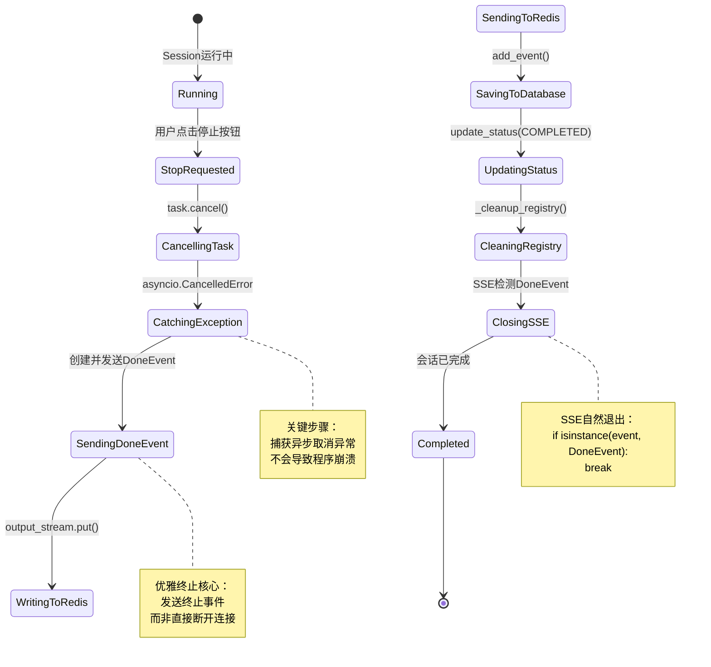
```mermaid
stateDiagram-v2
[*] --> Running: Session运行中

Running --> StopRequested: 用户点击停止按钮

StopRequested --> CancellingTask: task.cancel()

CancellingTask --> CatchingException: asyncio.CancelledError

CatchingException --> SendingDoneEvent: 创建并发送DoneEvent

SendingDoneEvent --> WritingToRedis: output_stream.put()
SendingToRedis --> SavingToDatabase: add_event()

SavingToDatabase --> UpdatingStatus: update_status(COMPLETED)

UpdatingStatus --> CleaningRegistry: _cleanup_registry()

CleaningRegistry --> ClosingSSE: SSE检测DoneEvent

ClosingSSE --> Completed: 会话已完成

Completed --> [*]

note right of CatchingException
关键步骤：
捕获异步取消异常
不会导致程序崩溃
end note

note right of SendingDoneEvent
优雅终止核心：
发送终止事件
而非直接断开连接
end note

note right of ClosingSSE
SSE自然退出：
if isinstance(event, DoneEvent):
break
end note
```
## 5. 数据模型
### 5.1 核心实体关系图
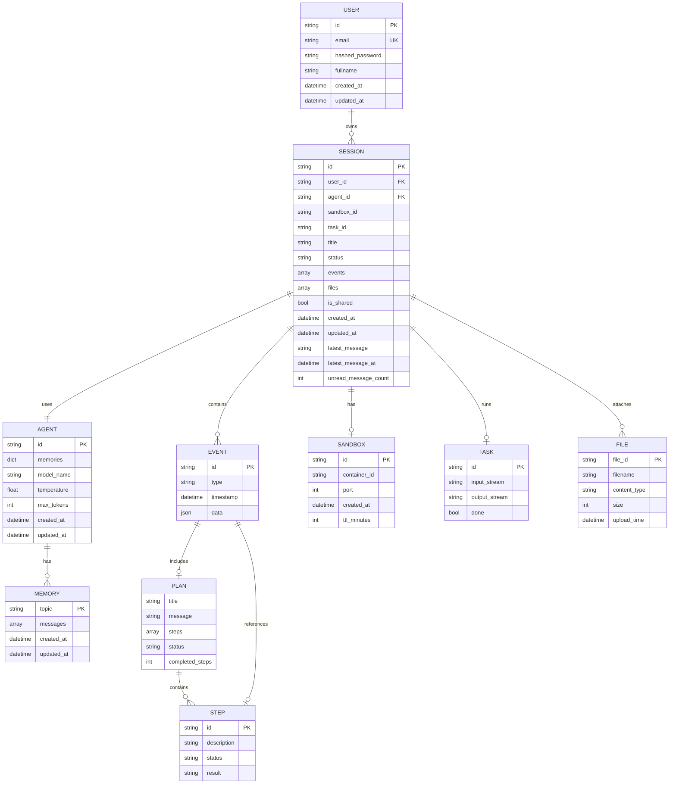
```mermaid
erDiagram
USER ||--o{ SESSION : owns
SESSION ||--|| AGENT : uses
SESSION ||--o{ EVENT : contains
SESSION ||--o| SANDBOX : has
SESSION ||--o| TASK : runs
SESSION ||--o{ FILE : attaches
AGENT ||--o{ MEMORY : has
PLAN ||--o{ STEP : contains
EVENT ||--o| PLAN : includes
EVENT ||--o| STEP : references

USER {
string id PK
string email UK
string hashed_password
string fullname
datetime created_at
datetime updated_at
}

AGENT {
string id PK
dict memories
string model_name
float temperature
int max_tokens
datetime created_at
datetime updated_at
}

SESSION {
string id PK
string user_id FK
string agent_id FK
string sandbox_id
string task_id
string title
string status
array events
array files
bool is_shared
datetime created_at
datetime updated_at
string latest_message
datetime latest_message_at
int unread_message_count
}

EVENT {
string id PK
string type
datetime timestamp
json data
}

PLAN {
string title
string message
array steps
string status
int completed_steps
}

STEP {
string id PK
string description
string status
string result
}

SANDBOX {
string id PK
string container_id
int port
datetime created_at
int ttl_minutes
}

TASK {
string id PK
string input_stream
string output_stream
bool done
}

FILE {
string file_id PK
string filename
string content_type
int size
datetime upload_time
}

MEMORY {
string topic PK
array messages
datetime created_at
datetime updated_at
}
```
### 5.2 Session状态转换
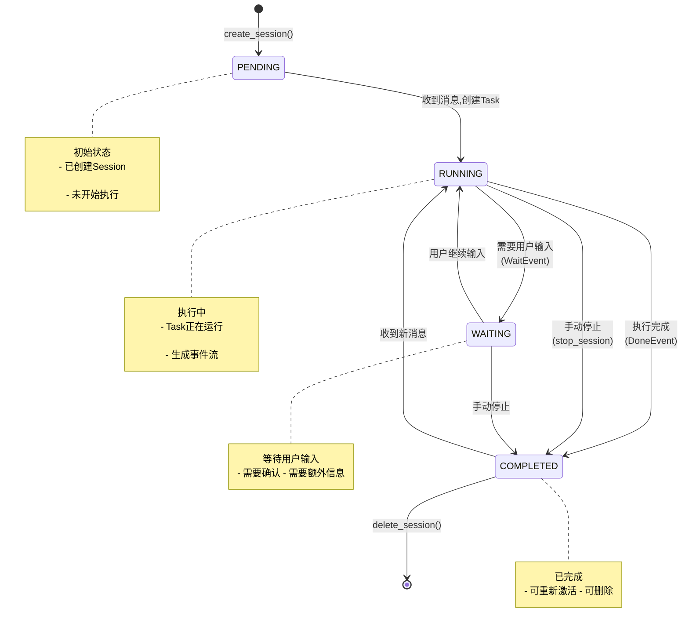
```mermaid

stateDiagram-v2

[*] --> PENDING: create_session()

  

PENDING --> RUNNING: 收到消息,创建Task

  

RUNNING --> WAITING: 需要用户输入<br/>(WaitEvent)

RUNNING --> COMPLETED: 执行完成<br/>(DoneEvent)

RUNNING --> COMPLETED: 手动停止<br/>(stop_session)

  

WAITING --> RUNNING: 用户继续输入

WAITING --> COMPLETED: 手动停止

  

COMPLETED --> RUNNING: 收到新消息

  

COMPLETED --> [*]: delete_session()

  

note right of PENDING

初始状态

- 已创建Session

- 未开始执行

end note

  

note right of RUNNING

执行中

- Task正在运行

- 生成事件流

end note

  

note right of WAITING

等待用户输入

- 需要确认

- 需要额外信息

end note

  

note right of COMPLETED

已完成

- 可重新激活

- 可删除

end note

```

  

### 5.3 Step状态转换

  

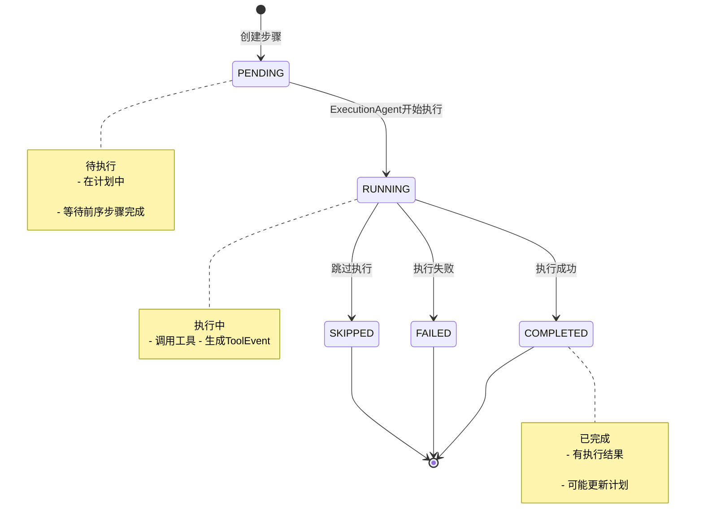
```mermaid

stateDiagram-v2

[*] --> PENDING: 创建步骤

  

PENDING --> RUNNING: ExecutionAgent开始执行

  

RUNNING --> COMPLETED: 执行成功

RUNNING --> FAILED: 执行失败

RUNNING --> SKIPPED: 跳过执行

  

COMPLETED --> [*]

FAILED --> [*]

SKIPPED --> [*]

  

note right of PENDING

待执行

- 在计划中

- 等待前序步骤完成

end note

  

note right of RUNNING

执行中

- 调用工具

- 生成ToolEvent

end note

  

note right of COMPLETED

已完成

- 有执行结果

- 可能更新计划

end note

```

  

---

  

## 6. 外部集成

  

### 6.1 LLM集成架构

  

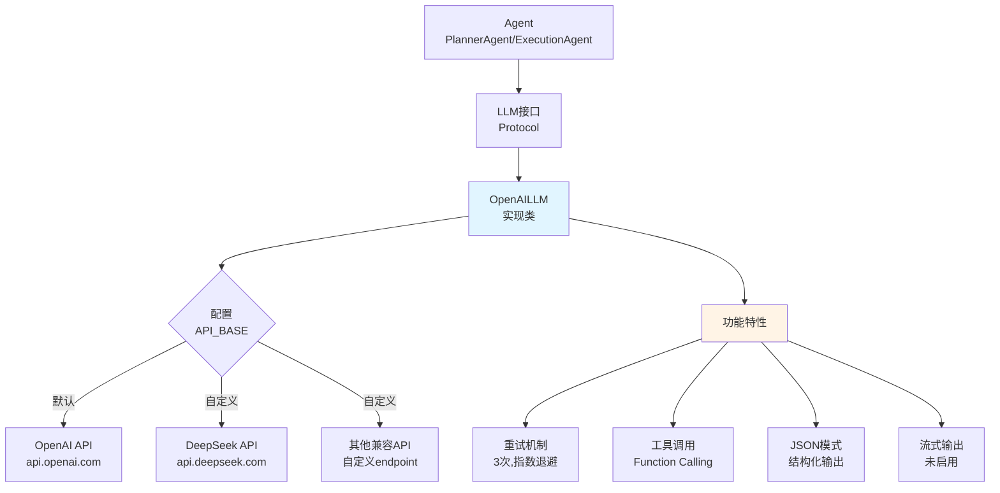
```mermaid

flowchart TD

Agent[Agent<br/>PlannerAgent/ExecutionAgent] --> LLMInterface[LLM接口<br/>Protocol]

  

LLMInterface --> OpenAILLM[OpenAILLM<br/>实现类]

  

OpenAILLM --> Config{配置<br/>API_BASE}

  

Config -->|默认| OpenAI[OpenAI API<br/>api.openai.com]

Config -->|自定义| DeepSeek[DeepSeek API<br/>api.deepseek.com]

Config -->|自定义| OtherLLM[其他兼容API<br/>自定义endpoint]

  

OpenAILLM --> Features[功能特性]

  

Features --> Retry[重试机制<br/>3次,指数退避]

Features --> Tools[工具调用<br/>Function Calling]

Features --> JSON[JSON模式<br/>结构化输出]

Features --> Stream[流式输出<br/>未启用]

  

style OpenAILLM fill:#e1f5ff

style Features fill:#fff4e6

```

  

### 6.2 沙盒集成架构

  

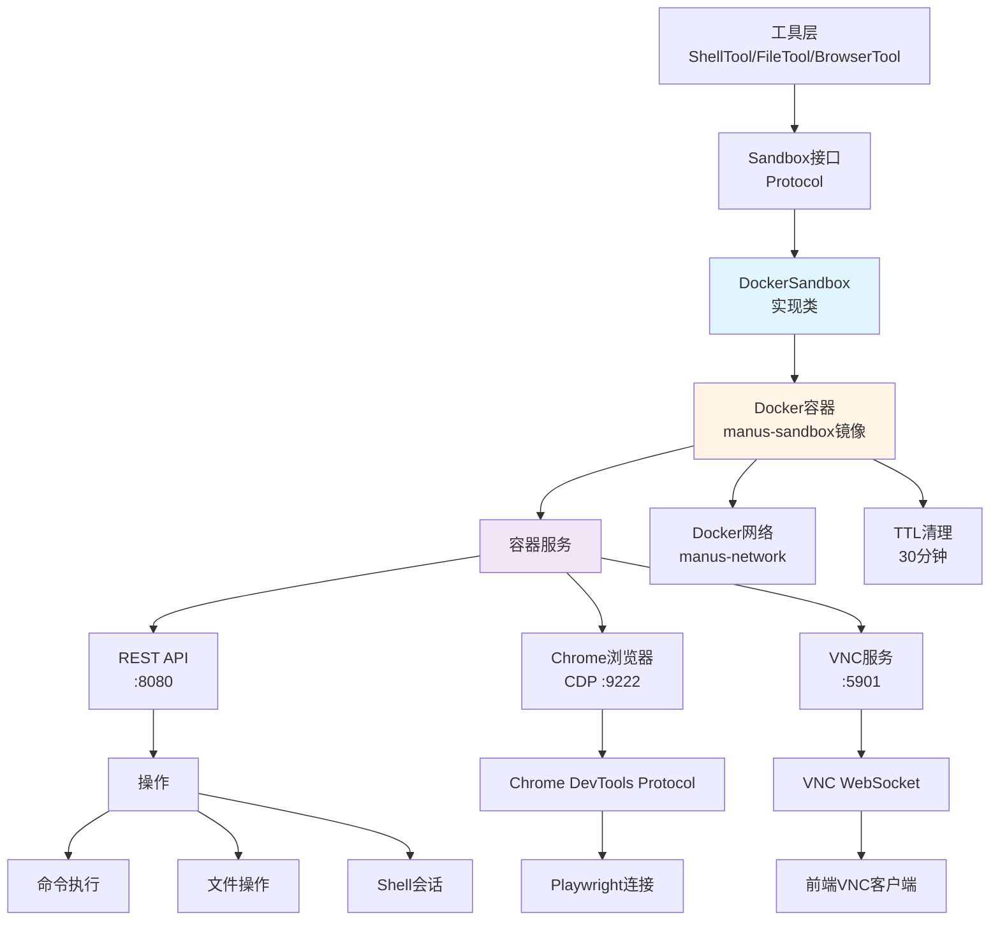
```mermaid

flowchart TD

Tools[工具层<br/>ShellTool/FileTool/BrowserTool] --> SandboxInterface[Sandbox接口<br/>Protocol]

  

SandboxInterface --> DockerSandbox[DockerSandbox<br/>实现类]

  

DockerSandbox --> Container[Docker容器<br/>manus-sandbox镜像]

  

Container --> Services[容器服务]

  

Services --> API[REST API<br/>:8080]

Services --> Browser[Chrome浏览器<br/>CDP :9222]

Services --> VNC[VNC服务<br/>:5901]

  

API --> Operations[操作]

Operations --> Exec[命令执行]

Operations --> FileOps[文件操作]

Operations --> ShellOps[Shell会话]

  

Browser --> CDP[Chrome DevTools Protocol]

CDP --> Playwright[Playwright连接]

  

VNC --> WebSocket[VNC WebSocket]

WebSocket --> Frontend[前端VNC客户端]

  

Container --> Network[Docker网络<br/>manus-network]

Container --> TTL[TTL清理<br/>30分钟]

  

style DockerSandbox fill:#e1f5ff

style Container fill:#fff4e6

style Services fill:#f3e5f5

```

  

### 6.3 搜索引擎集成

  

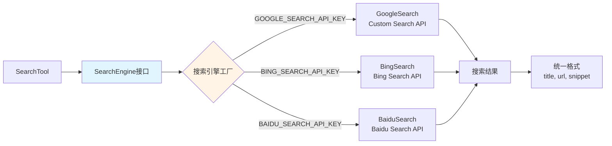
```mermaid

flowchart LR

SearchTool[SearchTool] --> SearchInterface[SearchEngine接口]

  

SearchInterface --> Factory{搜索引擎工厂}

  

Factory -->|GOOGLE_SEARCH_API_KEY| Google[GoogleSearch<br/>Custom Search API]

Factory -->|BING_SEARCH_API_KEY| Bing[BingSearch<br/>Bing Search API]

Factory -->|BAIDU_SEARCH_API_KEY| Baidu[BaiduSearch<br/>Baidu Search API]

  

Google --> Results[搜索结果]

Bing --> Results

Baidu --> Results

  

Results --> Format[统一格式<br/>title, url, snippet]

  

style SearchInterface fill:#e1f5ff

style Factory fill:#fff4e6

```

  

### 6.4 MCP (Model Context Protocol) 集成

  

```mermaid

flowchart TD

MCPTool[MCPTool<br/>工具封装] --> MCPClient[MCP客户端]

  

MCPClient --> Config[MCP配置<br/>mcp_config.json]

  

Config --> Servers[MCP服务器列表]

  

Servers --> Server1[文件系统服务器<br/>@modelcontextprotocol/server-filesystem]

Servers --> Server2[Git服务器<br/>@modelcontextprotocol/server-git]

Servers --> Server3[其他服务器<br/>自定义实现]

  

MCPClient --> Transport{传输方式}

  

Transport --> Stdio[Stdio传输<br/>本地进程]

Transport --> SSE[SSE传输<br/>HTTP流]

Transport --> StreamableHTTP[Streamable HTTP<br/>双向流]

  

MCPClient --> Discovery[工具发现]

Discovery --> DynamicTools[动态工具注册]

  

DynamicTools --> Execution[工具执行]

  

style MCPClient fill:#e1f5ff

style Transport fill:#fff4e6

```

  

### 6.5 Task管理架构

  

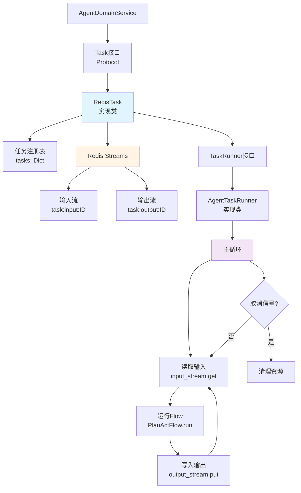
```mermaid

flowchart TD

AgentDomainService --> TaskInterface[Task接口<br/>Protocol]

  

TaskInterface --> RedisTask[RedisTask<br/>实现类]

  

RedisTask --> Registry[任务注册表<br/>tasks: Dict]

RedisTask --> Streams[Redis Streams]

  

Streams --> InputStream[输入流<br/>task:input:ID]

Streams --> OutputStream[输出流<br/>task:output:ID]

  

RedisTask --> TaskRunner[TaskRunner接口]

TaskRunner --> AgentTaskRunner[AgentTaskRunner<br/>实现类]

  

AgentTaskRunner --> Loop[主循环]

  

Loop --> ReadInput[读取输入<br/>input_stream.get]

ReadInput --> RunFlow[运行Flow<br/>PlanActFlow.run]

RunFlow --> WriteOutput[写入输出<br/>output_stream.put]

WriteOutput --> ReadInput

  

Loop --> Cancel{取消信号?}

Cancel -->|是| Cleanup[清理资源]

Cancel -->|否| ReadInput

  

style RedisTask fill:#e1f5ff

style Streams fill:#fff4e6

style Loop fill:#f3e5f5

```

  

---

  

## 7. 架构图

  

### 7.1 请求处理流程总览

  

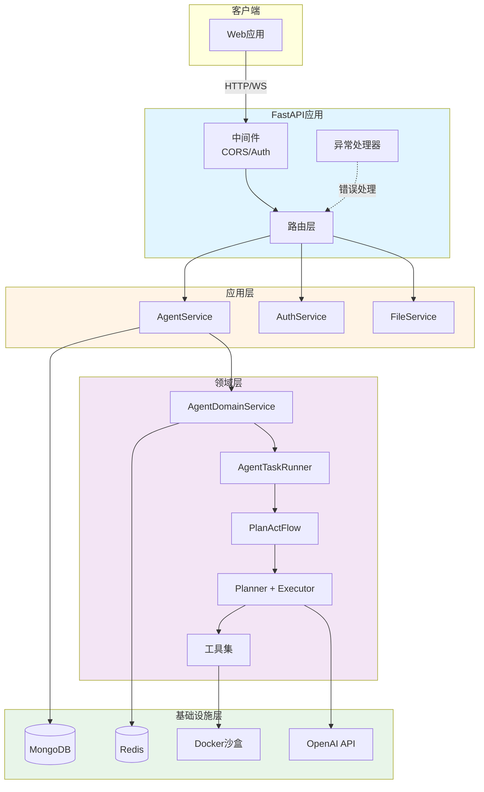
```mermaid

flowchart TB

subgraph Client[客户端]

WebApp[Web应用]

end

  

subgraph API[FastAPI应用]

Router[路由层]

Middleware[中间件<br/>CORS/Auth]

Handlers[异常处理器]

end

  

subgraph Application[应用层]

AgentSvc[AgentService]

AuthSvc[AuthService]

FileSvc[FileService]

end

  

subgraph Domain[领域层]

DomainSvc[AgentDomainService]

TaskRunner[AgentTaskRunner]

Flow[PlanActFlow]

Agents[Planner + Executor]

Tools[工具集]

end

  

subgraph Infrastructure[基础设施层]

MongoDB[(MongoDB)]

Redis[(Redis)]

Docker[Docker沙盒]

OpenAI[OpenAI API]

end

  

WebApp -->|HTTP/WS| Middleware

Middleware --> Router

Router --> AgentSvc

Router --> AuthSvc

Router --> FileSvc

  

AgentSvc --> DomainSvc

DomainSvc --> TaskRunner

TaskRunner --> Flow

Flow --> Agents

Agents --> Tools

  

AgentSvc --> MongoDB

DomainSvc --> Redis

Tools --> Docker

Agents --> OpenAI

  

Handlers -.->|错误处理| Router

  

style API fill:#e1f5ff

style Application fill:#fff4e6

style Domain fill:#f3e5f5

style Infrastructure fill:#e8f5e9

```

  

### 7.2 数据流向图

  

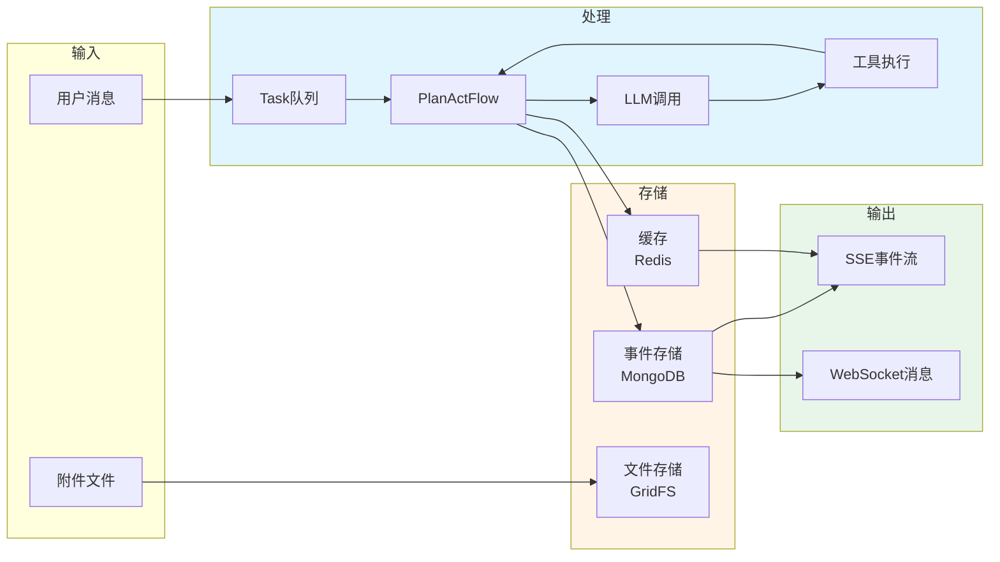
```mermaid

flowchart LR

subgraph Input[输入]

User[用户消息]

Files[附件文件]

end

  

subgraph Processing[处理]
direction TB
Task[Task队列]
Flow[PlanActFlow]
LLM[LLM调用]
Tools[工具执行]
end

subgraph Storage[存储]
Events[事件存储<br/>MongoDB]
Cache[缓存<br/>Redis]
FileStore[文件存储<br/>GridFS]
end

subgraph Output[输出]
SSE[SSE事件流]
WebSocket[WebSocket消息]
end

User --> Task
Files --> FileStore
Task --> Flow
Flow --> LLM
LLM --> Tools
Tools --> Flow
Flow --> Events
Flow --> Cache
Events --> SSE
Events --> WebSocket
Cache --> SSE

style Processing fill:#e1f5ff
style Storage fill:#fff4e6
style Output fill:#e8f5e9
```

### 7.3 技术栈依赖关系
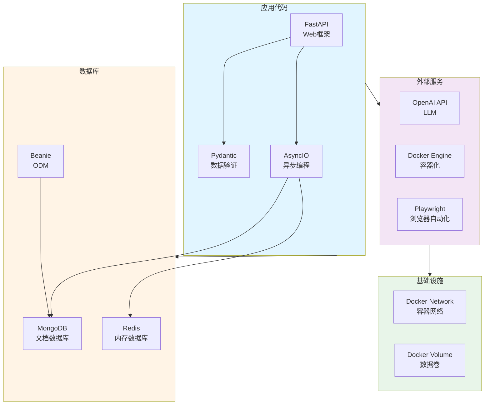
```mermaid
flowchart TD
subgraph Application[应用代码]
FastAPI[FastAPI<br/>Web框架]
Pydantic[Pydantic<br/>数据验证]
AsyncIO[AsyncIO<br/>异步编程]
end

subgraph Database[数据库]
MongoDB[MongoDB<br/>文档数据库]
Beanie[Beanie<br/>ODM]
Redis[Redis<br/>内存数据库]
end

subgraph External[外部服务]
OpenAI[OpenAI API<br/>LLM]
Docker[Docker Engine<br/>容器化]
Playwright[Playwright<br/>浏览器自动化]
end

subgraph Infrastructure[基础设施]
Network[Docker Network<br/>容器网络]
Volume[Docker Volume<br/>数据卷]
end

FastAPI --> Pydantic
FastAPI --> AsyncIO
Beanie --> MongoDB
AsyncIO --> MongoDB
AsyncIO --> Redis
Application --> Database
Application --> External
External --> Infrastructure

style Application fill:#e1f5ff
style Database fill:#fff4e6
style External fill:#f3e5f5
style Infrastructure fill:#e8f5e9
```

## 8. 设计模式总结
### 8.1 使用的设计模式
| 设计模式 | 应用位置 | 说明 |
|---------|---------|------|
| **分层架构** | 整体架构 | Domain, Application, Infrastructure, Interfaces四层分离 |
| **领域驱动设计(DDD)** | 领域层 | 聚合根(Agent, Session)、值对象、仓储模式 |
| **仓储模式** | 数据访问 | 抽象数据访问,领域层定义接口,基础设施层实现 |
| **工厂模式** | 依赖注入 | `get_agent_service()`等工厂函数创建服务实例 |
| **策略模式** | LLM/搜索引擎 | 多种LLM和搜索引擎实现,统一接口 |
| **装饰器模式** | 工具注册 | `@tool`装饰器注册工具元数据 |
| **状态模式** | PlanActFlow | 状态机(IDLE/PLANNING/EXECUTING/UPDATING/SUMMARIZING) |
| **观察者模式** | 事件系统 | 事件发布-订阅,通过Redis Streams |
| **模板方法模式** | BaseAgent | 抽象基类定义算法骨架,子类实现具体步骤 |
| **适配器模式** | 外部服务 | 将外部API适配为内部接口(如OpenAI API -> LLM接口) |
| **单例模式** | 服务实例 | `@lru_cache()`实现服务单例 |
| **责任链模式** | 异常处理 | FastAPI异常处理器链 |

### 8.2 SOLID原则体现
| 原则 | 体现 |
|-----|------|
| **单一职责原则(SRP)** | 每个服务、Agent、工具只负责一个职责 |
| **开闭原则(OCP)** | 通过接口和抽象类实现扩展,无需修改现有代码 |
| **里氏替换原则(LSP)** | 所有实现类可以替换接口类型(如不同的LLM实现) |
| **接口隔离原则(ISP)** | 细粒度的接口定义(LLM, Sandbox, Browser等分离) |
| **依赖倒置原则(DIP)** | 高层模块依赖抽象接口,不依赖具体实现 |

## 9. 总结
### 9.1 架构优势
1. **清晰的分层**: 业务逻辑与技术实现完全分离,易于测试和维护
2. **高度可扩展**: 基于接口编程,易于添加新的LLM、搜索引擎、工具
3. **事件溯源**: 完整的事件历史,支持调试和审计
4. **异步高并发**: 全异步设计,支持大量并发会话
5. **容器隔离**: Docker沙盒提供安全的代码执行环境
6. **实时交互**: SSE/WebSocket实现流式响应
### 9.2 技术亮点
1. **双Agent协作**: Planner负责规划,Executor负责执行,职责分离
2. **Plan-Act-Update循环**: 动态调整执行计划,适应复杂任务
3. **工具系统**: 装饰器模式,易于扩展
4. **MCP集成**: 支持Model Context Protocol,扩展能力强
5. **Redis Streams**: 高效的任务队列和事件流

### 9.3 未来扩展方向
1. **多模型支持**: 支持更多LLM提供商(Anthropic, Gemini等)
2. **分布式部署**: 支持多实例部署,负载均衡
3. **插件系统**: 热加载工具插件
4. **监控告警**: 集成Prometheus, Grafana
5. **性能优化**: 缓存策略,连接池优化
<!--stackedit_data:
eyJoaXN0b3J5IjpbMTc1MzM4NDE1OCwxMTEwMjg0MDI5LC03OD
Y4ODQ3MTIsLTE3MTAyMjIyMjMsNTcxMTgxMzI5LC0yNjk4MDI2
NDRdfQ==
-->