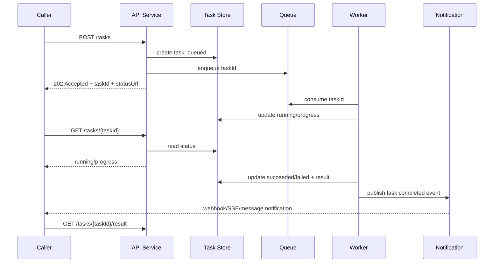

# 异步任务完成检测与通知机制详解

## 摘要

异步任务的核心问题不是“任务如何异步执行”，而是**任务完成状态如何被可靠地观察、传播与消费**。你提到的两种方案分别代表了两类典型模型：第一类是**任务 ID + 状态查询/轮询**，即调用者提交任务后拿到 `taskId`，随后通过状态接口或状态存储反复查询结果；第二类是**完成后通知/信号/回调**，即任务执行方在完成时主动唤醒或通知调用者。前者更通用、更容易跨进程和跨服务落地，后者更实时、更节省无效查询，但对调用方可达性、失败重试、幂等和生命周期管理要求更高。

在工程实践中，二者通常不是非此即彼。**最稳妥的架构往往是“状态可查询 + 完成可通知”组合模式**：提交任务时返回任务 ID 和状态查询地址，任务完成时再通过同进程回调、条件变量、事件总线、消息队列或 Webhook 推送通知；如果通知丢失，调用方仍可通过任务 ID 查询最终状态。HTTP 长任务 API 中常见的异步请求-回复模式也遵循这个思路：服务端快速返回 `202 Accepted`，通过 `Location` 暴露状态资源，并可使用 `Retry-After` 指导客户端何时再次查询。[1] [2]

## 1. 问题本质：异步任务完成检测是在解决什么

异步任务通常包含三个阶段：**提交、执行、完成消费**。提交阶段需要确认任务是否被接收；执行阶段需要承载任务状态、进度、取消、超时和错误；完成消费阶段则需要把结果或失败原因交给调用者。所谓“检测异步任务是否完成”，实际是在设计这三件事之间的通信协议。

| 维度 | 需要回答的问题 | 常见工程设计 |
| --- | --- | --- |
| 任务身份 | 如何唯一定位一次异步执行 | `taskId`、`jobId`、请求幂等键、工作流实例 ID |
| 状态表达 | 如何表示任务生命周期 | `queued`、`running`、`succeeded`、`failed`、`cancelled`、`timeout` |
| 结果承载 | 结果放在哪里 | 内存 Future、状态表、对象存储、结果表、消息体、回调请求体 |
| 完成传播 | 调用者如何知道已完成 | 轮询、阻塞等待、回调、条件变量、事件、消息队列、Webhook、SSE/WebSocket |
| 可靠性 | 通知丢了怎么办 | 持久化状态、可重试通知、幂等消费、死信队列、补偿扫描 |
| 生命周期 | 结果保存多久 | TTL、归档、清理任务、结果分页、下载链接过期 |

> **关键判断**：如果任务结果只在同一进程、同一生命周期内消费，可以优先使用 Future、Promise、回调、条件变量或事件；如果任务跨进程、跨服务、跨机器，必须把状态和结果持久化，并使用任务 ID、消息系统或 Webhook 等具有分布式语义的机制。

## 2. 两种方案的直接比较

你提出的第一种方式是“**提交异步任务得到任务 ID，再启动一个异步轮询任务去捞取结果**”。这种方案本质上是**状态资源模式**。调用者不直接等待任务线程，而是等待一个可查询的任务状态从未完成变成已完成。REST API 中常见做法是服务端返回 `202 Accepted` 和 `Location: /tasks/{id}`，调用者后续访问该状态端点，完成后再获取结果资源。[1] [2]

第二种方式是“**发布异步任务，然后通过信号的形式反馈给调用者**”。这里的“信号”在不同边界下含义不同。在同进程内，它可能是条件变量、Event、Future callback、Promise completion、观察者事件；在跨服务场景中，它通常对应 Webhook、消息队列、Pub/Sub 事件、SSE、WebSocket 或工作流回调。

| 比较项 | 任务 ID + 轮询 | 信号/回调/事件通知 |
| --- | --- | --- |
| 基本原理 | 调用者主动查询任务状态，直到终态 | 执行方在状态变化或完成时主动通知调用者 |
| 实时性 | 取决于轮询间隔，天然存在延迟 | 通常更接近实时 |
| 资源消耗 | 可能产生大量无效请求或无效查询 | 正常情况下更节省查询资源 |
| 实现复杂度 | 简单、直观、兼容性强 | 需要处理注册、生命周期、失败重试、幂等和安全 |
| 可靠性 | 只要状态持久化，查询路径可靠，调用者可恢复 | 通知可能丢失、重复、乱序，必须设计重试和兜底查询 |
| 调用方要求 | 调用方无需暴露服务，只要能发起查询 | 调用方必须可被回调，或能订阅消息/保持连接 |
| 分布式适配 | 很好，尤其适合 HTTP API 与跨服务长任务 | 也很好，但需要消息系统或可达的回调通道 |
| 适合场景 | 后台报表、文件处理、支付结果查询、第三方任务查询 | 即时通知、事件驱动架构、任务编排、服务间解耦 |
| 推荐结论 | 作为基础能力几乎必备 | 作为增强能力非常有价值，但不应成为唯一真相来源 |

轮询并不一定低级，它的优势是**简单、可恢复、边界清晰**。Tyk 对 API 轮询的分析指出，轮询是客户端重复请求端点以判断数据是否变化，但固定轮询容易浪费资源并造成较差实时体验；可通过退避、随机抖动、限流、轻量端点、条件请求等方式改善。[3] 因此，若业务规模小、完成时间短、结果可持久化，轮询是可接受甚至最稳妥的方案。

通知也不一定更好。通知模式真正困难的部分不在“发一个信号”，而在**信号丢失、重复、乱序、调用方不可达、回调失败、权限验证、重放攻击和幂等处理**。因此，在分布式系统里，通知通常只被视为“提醒你可以去查了”，而不是唯一可信的结果来源。真正可信的结果仍应落到任务状态表、结果表、对象存储或事件日志中。

## 3. 同进程内的异步完成检测方法

同进程内的特点是内存共享、对象引用可传递、线程生命周期相对可控。因此它可以使用更轻量的同步原语，不一定需要任务 ID 和外部状态表。但只要涉及线程池、协程调度、取消、超时和错误传播，仍然需要清晰的完成语义。

### 3.1 Future / Promise / CompletableFuture 模式

**Future** 是同进程异步编程中最常见的抽象。提交任务后，执行框架返回一个 Future 对象，调用者可以通过 `done()` 查询是否完成，通过 `result(timeout)` 或 `get(timeout)` 等待并获取结果，也可以注册完成回调。Python 官方文档说明，`Future` 封装异步 callable 的执行，由 `Executor.submit()` 创建；`done()` 表示任务已取消或完成；`result(timeout)` 会等待结果并在任务异常时重新抛出异常；`add_done_callback(fn)` 会在 Future 取消或完成时调用回调函数。[4]

| 方面 | 说明 |
| --- | --- |
| 原理 | 异步执行框架维护一个状态机，任务完成时写入结果或异常，并唤醒等待者或触发回调 |
| 应用场景 | 线程池任务、进程池任务、并发 RPC 调用、批量并行计算、同进程异步封装 |
| 优点 | 类型清晰，支持结果、异常、取消、超时和回调；调用方无需手写锁和条件变量 |
| 缺点 | 对象通常只在进程生命周期内有效；如果调用方阻塞 `get()` 可能耗尽线程池；回调执行线程需要谨慎控制 |
| 适用边界 | 最适合同进程或同运行时；跨服务时应映射为任务 ID、状态表或消息事件 |

典型伪代码如下：

```python
future = executor.submit(do_work, args)

# 方式一：主动查询
if future.done():
    result = future.result()

# 方式二：有限等待
try:
    result = future.result(timeout=3)
except TimeoutError:
    pass

# 方式三：完成回调
def on_done(f):
    try:
        print(f.result())
    except Exception as e:
        print("failed", e)

future.add_done_callback(on_done)
```

这种模式通常比“另起一个线程不断轮询某个变量”更好，因为 Future 已经封装了同步、异常传播和等待唤醒。如果你在同进程内使用线程池或协程框架，**优先选择 Future/Promise，而不是自己实现轮询线程**。

### 3.2 回调函数模式

回调模式是“任务完成后执行某个函数”。它可以直接挂在 Future 上，也可以由任务执行器维护监听器列表。与 Future 的区别在于，Future 强调结果对象和状态查询，回调强调完成后的控制流反转。

| 方面 | 说明 |
| --- | --- |
| 原理 | 调用者提交任务时传入回调函数；执行方在完成、失败或取消时调用回调 |
| 应用场景 | UI 事件、I/O 完成通知、同进程插件系统、轻量任务通知 |
| 优点 | 实时性好，无需调用者主动查询；代码可表达“完成后做什么” |
| 缺点 | 容易形成回调地狱；异常处理容易被忽略；回调运行在哪个线程必须明确；对象生命周期和内存泄漏需注意 |
| 推荐做法 | 回调中只做轻量逻辑，将耗时后续工作再投递到队列或执行器 |

回调适合简单链路，但复杂链路建议使用 Promise/CompletableFuture 的链式组合、协程 `async/await`，或工作流引擎来表达依赖关系。

### 3.3 条件变量 Condition / Event / CountDownLatch

条件变量是更底层的线程同步原语。C++ `std::condition_variable` 被定义为一种同步原语，用于阻塞一个或多个线程，直到另一个线程修改共享条件并通知；等待方必须在互斥锁保护下检查条件，并在被唤醒后重新检查条件，以处理虚假唤醒。[5]

| 方面 | 说明 |
| --- | --- |
| 原理 | 等待线程在条件不满足时释放锁并阻塞；执行线程修改共享状态后调用 `notify_one` 或 `notify_all` 唤醒等待者 |
| 应用场景 | 生产者-消费者、线程间阶段同步、无现成 Future 框架的底层并发控制 |
| 优点 | 性能高、控制精细、可唤醒一个或多个等待者 |
| 缺点 | 容易写错，存在虚假唤醒、丢通知、死锁和锁粒度问题；不直接承载异常和结果 |
| 推荐做法 | 总是用“条件谓词 + while 循环”或带谓词的 wait；把结果、状态和异常放在共享对象中 |

典型伪代码如下：

```text
lock(mutex)
while task.status not in terminal_states:
    condition.wait(mutex)
result = task.result
unlock(mutex)

# worker thread
lock(mutex)
task.status = succeeded
task.result = value
unlock(mutex)
condition.notify_all()
```

如果只是等待某个任务完成，直接使用 Future 通常更安全；如果你在实现一个并发队列、线程池或底层调度器，条件变量才是合适工具。

### 3.4 阻塞队列 / Channel / Actor Mailbox

阻塞队列把“完成结果”作为消息放入队列，调用者从队列阻塞读取。它不是查询某个任务是否完成，而是把完成事件转换为一个可消费的消息流。

| 方面 | 说明 |
| --- | --- |
| 原理 | 工作线程完成任务后向队列写入 `TaskResult`；消费者线程从队列读取并处理 |
| 应用场景 | 多生产者多消费者、批量异步结果收集、Actor 模型、管道式处理 |
| 优点 | 天然削峰，便于批量处理；消费者无需知道每个工作线程 |
| 缺点 | 如果需要按指定 `taskId` 查询单个结果，需要额外索引；队列满、消费者慢时要处理背压 |
| 推荐做法 | 结果消息中包含 `taskId`、状态、结果摘要、错误信息和时间戳 |

这种方法在同进程内非常适合“谁先完成先处理谁”的场景，对应 Python 的 `as_completed()`、Go channel、Java BlockingQueue 等模式。

### 3.5 async/await 与协程任务

在协程模型中，异步任务通常由事件循环调度，调用方通过 `await task` 等待完成，或注册回调。它与线程 Future 类似，但等待不会阻塞操作系统线程，而是把控制权交还给事件循环。

| 方面 | 说明 |
| --- | --- |
| 原理 | 任务在事件循环中推进，I/O 未就绪时挂起，完成时恢复等待协程 |
| 应用场景 | 高并发 I/O、HTTP 客户端、数据库异步访问、网关和实时服务 |
| 优点 | 高并发下资源占用低，代码结构比回调更线性 |
| 缺点 | CPU 密集型任务仍需线程池/进程池；阻塞调用会卡住事件循环 |
| 推荐做法 | I/O 用协程，CPU 或阻塞库调用投递到专门执行器，并把结果转回协程 Future |

## 4. 分布式跨服务的异步完成检测方法

跨服务场景与同进程场景的根本区别是：调用方和执行方之间没有共享内存，网络可能失败，进程可能重启，服务可能扩缩容。因此，不能依赖内存对象作为唯一状态。**任务状态必须外部化、持久化、可恢复、可审计**。

### 4.1 任务 ID + 状态表 + 轮询

这是分布式长任务最基础、最通用的方案。提交任务时，服务端创建任务记录并返回 `taskId`；后台 worker 执行任务并更新状态；调用方通过 `GET /tasks/{taskId}` 查询状态；完成后通过结果字段、结果 URL 或 `303 See Other` 获取最终资源。Azure 和 Zuplo 的异步 API 资料都把 `202 Accepted + Location 状态端点` 作为长任务 API 的典型模式。[1] [2]

| 方面 | 说明 |
| --- | --- |
| 原理 | 任务状态持久化在数据库、Redis、对象存储元数据或专门的 job store 中，客户端按间隔查询 |
| 应用场景 | 文件转码、批量导入导出、报表生成、AI 推理任务、第三方支付/物流状态查询 |
| 优点 | 简单可靠，客户端不需要暴露公网回调地址；服务重启后状态仍可查询；容易做权限校验和审计 |
| 缺点 | 实时性受轮询间隔限制；高并发轮询会增加数据库和 API 压力；客户端实现不当会形成请求风暴 |
| 优化手段 | `Retry-After`、指数退避、随机抖动、限流、ETag/If-None-Match、轻量状态端点、结果 TTL |

推荐的状态响应示例如下：

```http
HTTP/1.1 202 Accepted
Location: /api/tasks/8f3a
Retry-After: 5
Content-Type: application/json

{
  "taskId": "8f3a",
  "status": "queued",
  "statusUrl": "/api/tasks/8f3a"
}
```

```json
{
  "taskId": "8f3a",
  "status": "running",
  "progress": 62,
  "retryAfterSeconds": 3,
  "createdAt": "2026-05-21T07:00:00+08:00",
  "updatedAt": "2026-05-21T07:03:12+08:00"
}
```

```json
{
  "taskId": "8f3a",
  "status": "succeeded",
  "resultUrl": "/api/reports/20260521-001",
  "completedAt": "2026-05-21T07:04:30+08:00"
}
```

### 4.2 Webhook / HTTP 回调

Webhook 是跨服务版的“完成回调”。调用方在提交任务时提供 `callbackUrl`，执行方完成后向该 URL 发起 HTTP 请求，携带任务状态和结果摘要。Webhook 的优势是实时、解耦、减少轮询；缺点是调用方必须提供可访问的服务端点，并且必须处理安全和可靠性问题。Zuplo 资料也指出，Webhook 比轮询更快，但需要更多设置；失败时应结合指数退避重试，并最好提供状态端点作为兜底。[2]

| 方面 | 说明 |
| --- | --- |
| 原理 | 服务端保存回调地址，任务达到终态后发送 HTTP POST 通知调用方 |
| 应用场景 | 支付回调、云转码完成通知、SaaS 集成、订单状态变更、外部系统事件同步 |
| 优点 | 实时性好，无需调用方持续查询；适合事件驱动集成 |
| 缺点 | 调用方地址可能不可达；回调可能失败、重复、乱序；需要签名、鉴权、防重放和重试机制 |
| 推荐做法 | 使用 HMAC 签名、事件 ID、时间戳、幂等键、指数退避、死信队列和状态查询兜底 |

Webhook 请求示例如下：

```http
POST /client/callback HTTP/1.1
Content-Type: application/json
X-Event-Id: evt_123
X-Signature: sha256=...
X-Timestamp: 1779348000

{
  "eventType": "task.succeeded",
  "taskId": "8f3a",
  "status": "succeeded",
  "resultUrl": "https://api.example.com/reports/20260521-001"
}
```

在设计 Webhook 时，应把 HTTP `2xx` 视为投递成功，非 `2xx` 或超时视为投递失败。失败后执行方应进入重试队列，而不是在 worker 线程中无限阻塞。消费者必须以 `eventId` 或 `taskId + version` 做幂等，因为可靠通知系统通常是**至少一次投递**，重复通知是正常现象。

### 4.3 消息队列 / Pub/Sub / 事件总线

消息队列是分布式系统中最常用的异步完成通知机制之一。任务执行方完成后向 Kafka、RabbitMQ、Redis Stream、Pulsar、NATS 或云 Pub/Sub 发布事件；调用方作为消费者订阅并处理。与 Webhook 相比，消息队列不要求被通知方暴露 HTTP 端点，而是要求双方接入同一消息基础设施。

| 方面 | 说明 |
| --- | --- |
| 原理 | 执行方将完成事件写入 broker，消费者按订阅关系拉取或接收事件 |
| 应用场景 | 微服务内部事件、订单履约、数据管道、任务编排、跨服务解耦 |
| 优点 | 削峰填谷、可重试、可持久化、支持多个消费者；比直接 HTTP 回调更适合内部系统 |
| 缺点 | 引入 broker 运维复杂度；需要处理消息重复、乱序、积压、死信和消费位点 |
| 推荐做法 | 事件中只放必要摘要，大结果放对象存储；消费者幂等；关键事件启用持久化和死信队列 |

在分布式服务内部，如果你能控制双方系统并且已有消息基础设施，**消息队列通常优于服务间互相轮询**。不过消息事件最好仍然配合任务状态表，因为状态表提供当前事实，消息流提供事实变化过程。

### 4.4 SSE / WebSocket / 长轮询

SSE 和 WebSocket 适合需要把任务进度或完成状态实时推送到浏览器、桌面客户端或移动端的场景。它们不是任务执行机制，而是状态传播通道。服务端可以从任务状态表或消息队列读取变化，再通过连接推送给前端。

| 方面 | SSE | WebSocket | 长轮询 |
| --- | --- | --- | --- |
| 通信方向 | 服务端到客户端单向推送 | 双向通信 | 客户端发起请求，服务端挂起直到有变化或超时 |
| 适合场景 | 任务进度、通知流、日志流 | 协作编辑、实时聊天、双向控制 | 兼容性要求高、基础设施不支持长连接 |
| 优点 | 简单，基于 HTTP，自动重连较友好 | 实时性强，交互能力强 | 比固定轮询更实时且请求更少 |
| 缺点 | 不适合复杂双向协议 | 连接管理复杂，网关和负载均衡要适配 | 服务端连接占用时间长，超时处理复杂 |

对于“发布任务后通知调用者”，如果调用者是前端用户，推荐架构通常不是 worker 直接推前端，而是：worker 更新状态并发事件，后端通知网关订阅事件，再通过 SSE/WebSocket 推给用户。这样可以避免 worker 与连接层耦合。

### 4.5 工作流引擎与编排器

当异步任务不只是一个步骤，而是包含多个阶段、补偿、人工审批、重试、超时和依赖关系时，单纯的任务表和回调会迅速复杂化。此时可以考虑 Temporal、Cadence、Step Functions、Airflow、Argo Workflows 或其他工作流系统。

| 方面 | 说明 |
| --- | --- |
| 原理 | 工作流引擎持久化执行历史，调度活动任务，管理重试、定时器、信号和补偿 |
| 应用场景 | 订单履约、长事务 Saga、复杂审批、跨服务编排、批处理流水线 |
| 优点 | 内建状态持久化、重试、超时、可观测性和恢复能力 |
| 缺点 | 引入平台复杂度；学习成本高；不适合非常简单的单步任务 |
| 推荐做法 | 当任务链路超过多个服务、需要补偿或运行时间跨度很长时优先评估工作流引擎 |

工作流系统里的“检测完成”通常表现为等待某个活动完成、等待外部信号、等待定时器，或者查询工作流实例状态。它从架构层面把任务状态机显式化。

### 4.6 数据库通知、CDC 与补偿扫描

有些系统以数据库作为事实来源。任务完成时更新状态表，然后通过数据库通知、CDC、Outbox Pattern 或定时扫描发现状态变化。这类方法通常用于把业务写入和事件发布解耦，避免“数据库更新成功但消息发送失败”的不一致。

| 方面 | 说明 |
| --- | --- |
| 原理 | 任务状态写入数据库；通知器通过 outbox 表、CDC 日志或定时扫描把变化发布出去 |
| 应用场景 | 高可靠业务事件、遗留系统集成、事件最终一致性、任务补偿 |
| 优点 | 状态与业务事务一致；可恢复；适合作为通知失败的兜底机制 |
| 缺点 | 实时性取决于扫描或 CDC 延迟；实现和运维复杂度较高 |
| 推荐做法 | 关键业务使用事务 outbox，避免在业务事务中直接调用外部系统 |

这种方案不一定是用户直接感知的“完成检测方式”，但它常常是保证通知可靠性的底层机制。

## 5. 应该选择哪种方式

如果只在你描述的两种方式之间选择，结论可以概括为：**同进程内优先 Future/Promise/事件回调，不要另起线程忙轮询；分布式跨服务优先任务 ID + 持久化状态作为基础能力，再按实时性需求增加 Webhook 或消息事件。**

| 场景 | 推荐方案 | 原因 |
| --- | --- | --- |
| 同进程线程池任务，调用者需要结果 | Future/Promise + `result(timeout)` 或 callback | 框架已处理同步、异常、取消和唤醒 |
| 同进程多个任务谁先完成先处理 | `as_completed`、完成队列、Channel | 适合结果流式消费，避免逐个轮询 |
| 同进程底层同步控制 | Condition/Event/CountDownLatch | 适合实现线程池、队列或阶段同步 |
| HTTP 长耗时任务 | `202 Accepted + taskId + statusUrl + Retry-After` | 通用、可恢复、易鉴权、易审计 |
| 第三方系统需要被动接收完成通知 | Webhook + 状态查询兜底 | 实时性好，同时避免通知丢失导致不可恢复 |
| 微服务内部事件传播 | 消息队列/PubSub + 状态表 | 解耦、削峰、支持多消费者和重试 |
| 浏览器展示进度 | 状态接口 + SSE/WebSocket | 前端实时体验好，仍可刷新后恢复 |
| 多阶段长事务 | 工作流引擎 | 状态、重试、补偿、超时和可观测性内建 |

## 6. 推荐的通用落地架构

一个稳健的异步任务系统通常采用如下组合：调用者提交任务，API 层创建任务记录并返回任务 ID；任务进入队列；worker 消费任务并更新状态；完成后写入结果并发布事件；通知层根据订阅关系发送 Webhook、站内通知、SSE 或消息；调用者始终可以通过状态接口查询最终事实。



这个架构的核心是把**状态查询路径**和**通知路径**分开。状态查询路径回答“现在事实是什么”，通知路径回答“事实刚刚发生了变化”。两者结合后，系统既能实时，又能恢复。

## 7. 状态模型与接口设计建议

异步任务的状态模型应尽量简单、明确、单向推进。不要只用 `true/false` 表示完成，否则无法表达排队中、执行中、失败、取消、超时和部分成功等状态。

| 状态 | 含义 | 是否终态 | 常见后续动作 |
| --- | --- | --- | --- |
| `accepted` | 请求已接收但尚未入队或初始化 | 否 | 等待入队 |
| `queued` | 已入队等待 worker 执行 | 否 | 可取消、可查询排队时间 |
| `running` | 正在执行 | 否 | 查询进度、可尝试取消 |
| `succeeded` | 成功完成 | 是 | 读取结果或结果 URL |
| `failed` | 执行失败 | 是 | 返回错误码、错误消息、是否可重试 |
| `cancelled` | 被用户或系统取消 | 是 | 返回取消原因 |
| `timeout` | 超过最大执行时间 | 是 | 可补偿或重试 |

接口层面建议使用如下约定：提交接口返回 `202 Accepted`；状态接口在任务未完成时返回 `200 OK` 和当前状态；完成后可以继续返回 `200 OK` 携带结果摘要，也可以返回 `303 See Other` 指向结果资源；如果任务 ID 不存在返回 `404`；如果用户无权访问该任务返回 `403`；如果轮询过快返回 `429` 并附带 `Retry-After`。[1] [2]

## 8. 可靠性与安全最佳实践

异步任务系统最容易出问题的地方不是“线程有没有执行”，而是边界条件。以下实践对同进程和分布式场景都很重要，只是实现手段不同。

| 问题 | 风险 | 推荐做法 |
| --- | --- | --- |
| 重复提交 | 用户刷新或网络重试导致多个相同任务 | 使用幂等键 `Idempotency-Key`，对相同请求返回同一个任务 |
| 重复通知 | 至少一次投递导致同一事件多次到达 | 消费者按 `eventId` 或 `taskId + version` 幂等处理 |
| 通知丢失 | 回调失败或消费者宕机 | 持久化状态，通知重试，死信队列，允许主动查询 |
| 轮询风暴 | 大量客户端固定间隔查询 | `Retry-After`、指数退避、随机抖动、限流、缓存 |
| 结果过大 | 状态接口响应巨大或超时 | 状态接口只返回摘要，大结果放对象存储或结果资源 |
| 权限泄露 | 用户猜测 taskId 查询他人任务 | 使用不可预测 ID，按 owner 校验权限，必要时使用短期签名 URL |
| 回调伪造 | 攻击者伪造完成通知 | HMAC 签名、时间戳、防重放、mTLS 或 OAuth/JWT |
| worker 崩溃 | 任务卡在 running | 心跳、租约、超时扫描、可重试状态迁移 |
| 结果无人领取 | 存储无限增长 | TTL、归档、清理任务、结果生命周期策略 |

Webhook 和消息队列消费者尤其要记住：**不要假设事件只会来一次，也不要假设事件一定按顺序到达**。如果顺序很重要，应引入版本号、单任务串行消费、分区键或状态机校验。

## 9. 对你问题的最终建议

如果你的任务只发生在一个进程内，并且调用者是代码对象而不是外部服务，建议不要采用“发布任务后再启动一个异步轮询线程捞结果”。这种做法会增加线程数量和调度复杂度，还容易出现无效轮询。更好的方式是使用 **Future/Promise/CompletableFuture、回调、条件变量或完成队列**。其中 Future/Promise 是首选，因为它天然表达了“未来会有一个结果或异常”。

如果你的任务跨进程、跨服务或跨机器，建议把“任务 ID + 状态查询”作为基础协议。它是系统的可恢复事实来源。随后根据实时性要求增加通知机制：内部服务优先消息队列或事件总线；外部客户或第三方系统使用 Webhook；浏览器用户使用 SSE 或 WebSocket；复杂多阶段流程使用工作流引擎。也就是说，**轮询负责可靠兜底，通知负责及时触达**。

在绝大多数生产系统中，最佳实践不是在“轮询”和“信号”之间二选一，而是分层设计：

| 层次 | 职责 | 推荐机制 |
| --- | --- | --- |
| 事实层 | 保存任务当前状态和最终结果 | 数据库/Redis/对象存储/工作流状态 |
| 执行层 | 异步执行任务 | 线程池、协程、worker、队列 |
| 查询层 | 让调用者随时恢复状态 | `GET /tasks/{taskId}`、状态表查询 |
| 通知层 | 让调用者尽快知道状态变化 | 回调、事件、消息队列、Webhook、SSE/WebSocket |
| 保障层 | 处理失败、重复、超时和权限 | 幂等、重试、死信、签名、限流、TTL、监控 |

因此，你可以采用如下决策：若是**同进程内**，用 Future/Promise 或条件变量通知；若是**分布式跨服务**，用任务 ID 和持久化状态作为主干，再按需要加 Webhook 或消息队列；若对用户体验有实时要求，再加 SSE/WebSocket；若流程复杂且长时间运行，则上工作流引擎。

## 10. 简化选型口诀

> **同进程：Future 优先，Condition 兜底；跨服务：状态优先，通知增强；外部集成：Webhook 加签名；内部解耦：消息队列；前端实时：SSE/WebSocket；复杂流程：工作流。**

## References

[1]: https://learn.microsoft.com/en-us/azure/architecture/patterns/asynchronous-request-reply "Microsoft Azure Architecture Center: Asynchronous Request-Reply Pattern"

[2]: https://zuplo.com/learning-center/asynchronous-operations-in-rest-apis-managing-long-running-tasks/ "Zuplo: Asynchronous Operations in REST APIs: Managing Long-Running Tasks"

[3]: https://tyk.io/blog/moving-beyond-polling-to-async-apis/ "Tyk: Moving beyond API polling to asynchronous API design"

[4]: https://docs.python.org/3/library/concurrent.futures.html "Python Documentation: concurrent.futures — Launching parallel tasks"

[5]: https://en.cppreference.com/w/cpp/thread/condition_variable "cppreference: std::condition_variable"
